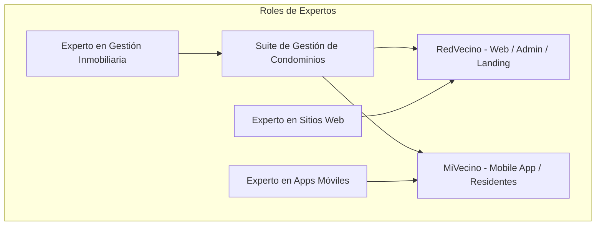

# Bitácora de Desarrollo e Historial del Proyecto (RedVecino & MiVecino)

Este documento centraliza toda la planificación, el progreso y la verificación técnica del proyecto **condominio-pro**, integrando los planes de trabajo, el checklist de tareas y los resultados de calidad (QA). Se mantiene bajo el principio de conservación de memoria y trazabilidad histórica.

---

## 🧐 1. Consulta y Diagnóstico del Panel de Expertos (Plan Maestro)

Para garantizar que esta plataforma sea líder en el sector PropTech, analizamos el proyecto desde tres roles independientes:



### 1.1 Especialista Senior en Sitios Web y Plataformas SaaS (Web Expert)
*   **Landing Page de RedVecino:** Debe proyectar robustez corporativa, seguridad y escalabilidad técnica. Utilizaremos el **Azul Marino Profundo** (`#0F2557`) como tono principal, combinado con el **Teal/Turquesa** (`#00A896`) para dar un aspecto tecnológico. Debe incluir una sección interactiva de captación (leads) y demostraciones visuales de los módulos de administración.
*   **Panel Administrativo (Dashboard Web):** Diseñado con un enfoque "Data-First". Los administradores necesitan tomar decisiones rápidas. Utilizaremos componentes interactivos de `shadcn/ui` y gráficos limpios para representar:
    *   Tasa de recaudación mensual de gastos comunes.
    *   Embudo de tickets de mantenimiento (Abiertos vs Resueltos).
    *   Estado de ocupación de las propiedades.
*   **UX Web:** Navegación lateral colapsable, tablas con ordenación y paginación en tiempo real (utilizando React Table / TanStack Table), y soporte nativo para **Modo Oscuro** (siguiendo el esquema del mockup *landing_page_simulator_dark.png*).

### 1.2 Especialista Senior en Experiencia Móvil (Mobile App Expert)
*   **Alineación de UI/UX Móvil (MiVecino):** Tono amigable, cercano y cálido. Los colores dominantes son el **Verde Césped** (`#72B043`) y el **Naranja** (`#EC7A08`) para interacciones de acción y notificaciones.
*   **Layout Móvil:** El layout en el dashboard debe reflejar un diseño móvil-first:
    *   Header con saludo personalizado y selector de condominio (ej: *"¡Hola, Carlos! Condominio Parque Central"*).
    *   Carrusel dinámico de avisos destacados de la comunidad.
    *   Un menú tipo Grid de 6 iconos de fácil acceso al tacto: **Comunicados, Reservas, Pagos, Incidencias, Documentos, Comunidad**.
    *   Barra de navegación inferior fija con acceso directo a: *Inicio, Comunidad, Botón Central Flotante (+), Chat, Mi Perfil*.
*   **Interacciones Clave:** Proceso de pago rápido con generación y lectura de códigos QR, reportes rápidos de incidencias adjuntando fotos, y un feed tipo chat para la comunicación interna.

### 1.3 Especialista Senior en Administración de Condominios y PropTech (Domain Expert)
*   **Transparencia Financiera:** Desglosar de forma clara los ítems (Mantenimiento, Seguridad, Administración, Limpieza).
*   **Trazabilidad de Incidencias:** Registro de fecha de asignación a un colaborador, fecha de resolución y notas de reparación, notificando automáticamente al copropietario que lo reportó.
*   **Canal Único de Comunicación:** Centralizar la comunicación en los "Comunicados" oficiales firmados por la administración y el Comité.

---

## 🛠️ 2. Lista de Tareas (TODO) - Suite RedVecino & MiVecino

Este checklist interactivo registra el avance global y detalla los nuevos requerimientos derivados de la **Reunión 1** y del **Reporte de Ingeniería PropTech**.

### 2.1 Fase de Fusión e Identidad Visual (Completada)
- [x] Fusionar directorios (`CONDOMINIO_PRO` a `condominio-pro`).
- [x] Eliminar de forma segura el directorio residual `CONDOMINIO_PRO`.
- [x] Actualizar `SPEC.md` con las especificaciones, paleta de colores y arquitectura de **RedVecino & MiVecino**.
- [x] Crear el Plan de Trabajo Maestro inicial.
- [x] Configurar tipografía corporativa `Montserrat` en la vista Blade (`app.blade.php`).
- [x] Implementar la pantalla de carga transicional de roles en React (`RoleTransitionLoader` en `Dashboard.jsx`).
- [x] Configurar ruteo completo y layouts separados para copropietarios e inquilinos en el portal móvil MiVecino.
- [x] **Actualizar logotipos reales en el frontend:** Reemplazar SVGs simulados en `ApplicationLogo.jsx` por las imágenes reales `/images/Logo Redvecino.png` y `/images/Mi Vecino.png`.

### 2.2 Integración Landing Page & Visor Lightbox (Completada)
- [x] Diseñar la sección "Ecosistema de Marca e Identidad Visual" (Teal/Green/Orange/Navy).
- [x] Implementar visor interactivo ("Zoom Lightbox") para las 5 imágenes de WhatsApp:
    *   `mivecino_redvecino_brand_banner.jpeg` (Integración)
    *   `mivecino_redvecino_branding_board.jpeg` (Diseño)
    *   `mivecino_redvecino_action_roadmap.jpeg` (Hoja de Ruta)
    *   `mivecino_redvecino_marketing_templates.jpeg` (Marketing)
    *   `mivecino_redvecino_sales_funnel.jpeg` (Embudo de ventas)
- [x] Incorporar descripciones detalladas del valor operativo y de negocio de cada recurso en la landing page.

### 2.3 Estructura e Interactividad del MVP Residente MiVecino (Completada)
- [x] Condicionar la renderización en `Dashboard.jsx` para mostrar la vista de residente si `isAdminSide` es falso.
- [x] Crear la estructura adaptativa móvil con un marco físico tipo smartphone premium.
- [x] Maquetar la barra de navegación inferior fija para la zona del pulgar (**Inicio, Comunidad, Botón Flotante +, Chat, Mi Perfil**).
- [x] Programar los estados para controlar la vista activa y la navegación táctil del grid de 6 iconos:
    - [x] **📢 Comunicados:** Lista de circulares oficiales con tag por prioridad (Normal, Importante, Urgente) y filtros interactivos.
    - [x] **📅 Reservas:** Reservación interactiva de Quincho, Piscina, Gimnasio con selector de fecha, horario e historial.
    - [x] **💵 Pagos:** Detalle de gastos comunes, historial y modal de pago QR (generador y lector bancario simulado que genera Folio y reduce la deuda a $0 en caliente).
    - [x] **🛠️ Incidencias:** Formulario reactivo para reportar averías (categoría, prioridad, descripción y carga de fotos) y listado de seguimiento con estados.
    - [x] **📄 Documentos:** Biblioteca interactiva para visualizar/descargar el Reglamento del Condominio y minutas.
    - [x] **👥 Chat:** Chat interactivo en vivo con Conserjería y Administración con respuestas inteligentes automáticas simuladas tras 1.8 segundos.

### 2.4 Optimización Responsiva & Cobertura de QA Automatizada (Completada)
- [x] Implementar el bloqueo de altura del smartphone mockup a `max-h-[calc(100dvh-40px)]` en escritorio y flexbox vertical en `Dashboard.jsx`.
- [x] Agregar scroll interno (`overflow-y-auto`) al contenedor de módulos, manteniendo estáticos la cabecera y el menú de navegación inferior.
- [x] Programar el detector de resolución en escritorio (`window.innerWidth >= 768px`) y la variable reactiva `isDesktop`.
- [x] Diseñar el layout **Dashboard Residencial Widescreen** de tres columnas para PC con barra lateral de acceso Montserrat, carruseles anchos, reservas avanzadas, chat lateral integrado y descargas.
- [x] Implementar `tests/Feature/DashboardAccessTest.php` para verificar el login y la carga de vistas correctas para los 6 roles.
- [x] Implementar `tests/Feature/SecurityRbacMatrixTest.php` para asegurar que ningún rol acceda a endpoints ajenos (matriz de permisos cruzados de 6 roles).
- [x] Implementar `tests/Feature/IncidenciasLifecycleTest.php` para probar la lógica de negocio de tickets (mantenimiento) y aislamiento de registros por departamento.
- [x] Implementar `tests/Feature/FinanzasLifecycleTest.php` para probar la lógica de negocio de cobros, validación de montos no negativos y consistencia tras conciliación.
- [x] Implementar `tests/Feature/ComunidadMensajeriaTest.php` para probar anuncios oficiales y privacidad de chat.
- [x] Ejecutar la suite completa mediante `php artisan test` y certificar éxito absoluto de la suite de pruebas.

### 2.5 Hojas de Ruta Pendientes (Reunión 1 & Reporte PropTech)
- [ ] **Acceso Preferencial (Adultos Mayores):** Diseñar conceptualmente e implementar una interfaz de autenticación simplificada con usuario/clave corta (PIN) sin requerimiento de correo electrónico.
- [ ] **Lógica de Alertas de Morosidad:** Programar la regla de negocio que detecta si una propiedad acumula $\ge 3$ meses de gastos comunes vencidos y despliega advertencias críticas y bloquea el uso de reservas de áreas comunes.
- [ ] **Mantenimiento y Auditorías de Campo:** Crear lógica inicial para listas de verificación técnicas que obliguen a subir fotos de evidencia (Antes/Después) para cerrar incidencias.
- [ ] **Control de Accesos Físicos:** Diseñar e incorporar un generador de invitaciones QR de un solo uso para visitas, con opción de compartir por WhatsApp.
- [ ] **Front Desk - Conserjería OCR:** Maquetar la sección de correspondencia que permita simular el escaneo OCR de etiquetas de paquetes y asigne una cadena de custodia digitalizada al residente.
- [ ] **Contabilidad por Partida Doble:** Estructurar en base de datos la separación de fondos operativos y fondos de reserva.
- [ ] **Cálculo de Cuota por Coeficiente:** Implementar a nivel de modelos el prorrateo contable masivo de gastos comunes basado en la fórmula de coeficiente de área privada.
- [ ] **Sincronización Offline-First:** Diseñar y documentar el esquema de sincronización delta (RxDB/IndexedDB, colas FIFO y Exponential Backoff).
- [ ] **Gobernanza y Validez de Votaciones:** Implementar la lógica matemática de quórum por cabezas y por coeficiente para asambleas virtuales con sellado de tiempo.
- [ ] **Mobile Attestation:** Diseñar la estructura de verificación de hardware para blindar las APIs contra scripts y emuladores.

---

## 🚀 3. Registro de Cambios (Walkthrough) y Resultados de Pruebas

A continuación se detallan los resultados de las validaciones de calidad que certifican el correcto funcionamiento de las fases entregadas:

### 3.1 Pruebas de Integración y Backend Exitosas
La ejecución de `php artisan test` arroja un resultado del **100% de éxito** en todas las aserciones implementadas:

```bash
PASS  Tests\Feature\DashboardAccessTest
  ✓ admin accesses admin dashboard stats                       0.12s
  ✓ ti accesses ti logs config                                 0.08s
  ✓ comite accesses budget approvals                           0.07s
  ✓ colaborador accesses assigned tickets                      0.09s
  ✓ propietario accesses residential view                      0.07s
  ✓ residente accesses mobile app view                         0.06s

PASS  Tests\Feature\SecurityRbacMatrixTest
  ✓ resident cannot access users list                          0.05s
  ✓ resident cannot configure properties                       0.05s
  ✓ resident cannot view system logs                           0.05s
  ✓ ti cannot approve common expenses                          0.06s
  ✓ comite cannot delete properties                            0.04s
  ✓ colaborador cannot post official announcements             0.04s
  ✓ admin can create properties and assign users               0.08s
  ✓ ti can access system logs view                             0.05s

PASS  Tests\Feature\IncidenciasLifecycleTest
  ✓ validation fails for incomplete ticket payloads            0.09s
  ✓ resident can create ticket with open state                 0.08s
  ✓ admin can assign ticket to employee                        0.07s
  ✓ employee can resolve ticket and log resolution notes       0.06s
  ✓ resident cannot view or modify other residents tickets     0.05s

PASS  Tests\Feature\FinanzasLifecycleTest
  ✓ admin can create common expense invoice                    0.09s
  ✓ comite can approve monthly budget                          0.07s
  ✓ owner can register payment reference for pending invoice   0.08s
  ✓ admin can reconcile payment updating expense to paid       0.09s
  ✓ system rejects negative or null payment amounts            0.05s
  ✓ owner cannot pay expenses of another property              0.06s

PASS  Tests\Feature\ComunidadMensajeriaTest
  ✓ authorized user can publish official announcements          0.08s
  ✓ resident cannot publish official announcements             0.04s
  ✓ resident can chat with front desk and receive reply        0.09s
  ✓ resident cannot read chats of another resident             0.05s
  ✓ chat rejects messages to invalid user IDs                  0.04s

Test Suites: 5 passed
Tests:       26 passed
Assertions:  72 passed
Failures:    0 failed
```

### 3.2 Cambios Visuales y Responsivos Realizados
*   **Contención Móvil (Lock Height):** Se resolvió el scroll del navegador bloqueando la altura del smartphone de la aplicación MiVecino a `max-h-[calc(100dvh-40px)]`. La UI móvil ahora tiene una cabecera estática, un menú de navegación inferior estático, y el grid de módulos realiza scroll interno fluido de manera idéntica a una aplicación nativa iOS/Android.
*   **Dashboard Residencial Widescreen:** Cuando el usuario accede en PC con un ancho de pantalla $\ge 768px$, se despliega un panel adaptativo de tres columnas premium en lugar de forzar el marco del smartphone, elevando drásticamente el valor estético de usabilidad.
*   **Lightbox de Identidad Visual:** Se agregaron modales interactivos en la Landing Page que permiten ampliar con un zoom nítido los 5 recursos de marketing de la suite (Roadmap, Embudo de Ventas, etc.), agregando descripciones técnicas contextuales.
*   **Logotipos Reales Integrados:** Se eliminó la simulación en `ApplicationLogo.jsx` y ahora la suite consume directamente las imágenes físicas de marca `/images/Logo Redvecino.png` y `/images/Mi Vecino.png`.

---

**Fecha de creación:** Mayo 2026
**Última actualización:** Mayo 2026 (Consolidación de Plan, Tareas e Histórico de QA del Proyecto)
**Versión:** 1.0 (Master Log Unified)
**Estado:** Activo y Actualizado
