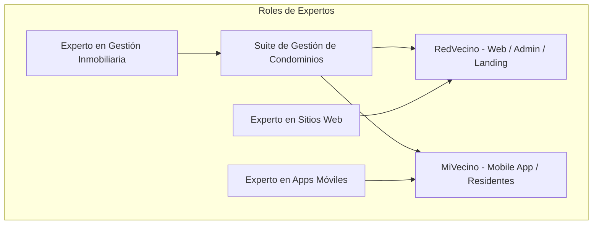

# Bitácora de Desarrollo e Historial del Proyecto (RedVecino & MiVecino)

Este documento centraliza toda la planificación, el progreso y la verificación técnica del proyecto **condominio-pro**, integrando los planes de trabajo, el checklist de tareas y los resultados de calidad (QA). Se mantiene bajo el principio de conservación de memoria y trazabilidad histórica.

---

## 🧐 1. Consulta y Diagnóstico del Panel de Expertos (Plan Maestro)

Para garantizar que esta plataforma sea líder en el sector PropTech, analizamos el proyecto desde tres roles independientes:


```mermaid
graph TD
    A[Suite de Gestión de Condominios] --> B[RedVecino - Web / Admin / Landing]
    A --> C[MiVecino - Mobile App / Residentes]
    
    subgraph Roles de Expertos
    D[Experto en Sitios Web] --> B
    E[Experto en Apps Móviles] --> C
    F[Experto en Gestión Inmobiliaria] --> A
    end
```

### 1.1 Especialista Senior en Sitios Web y Plataformas SaaS (Web Expert)
*   **Landing Page de RedVecino:** Debe proyectar robustez corporativa, seguridad y escalabilidad técnica. Utilizaremos el **Azul Marino Profundo** (`#0F2557`) como tono principal, combinado con el **Teal/Turquesa** (`#00A896`) para dar un aspecto tecnológico. Debe incluir una sección interactiva de captación (leads) y demostraciones visuales de los módulos de administración.
*   **Panel Administrativo (Dashboard Web):** Diseñado con un enfoque "Data-First". Los administradores necesitan tomar decisiones rápidas. Utilizaremos componentes interactivos de `shadcn/ui` y gráficos limpios para representar:
    *   Tasa de recaudación mensual de gastos comunes.
    *   Embudo de tickets de mantenimiento (Abiertos vs Resueltos).
    *   Estado de ocupación de las propiedades.
*   **UX Web:** Navegación lateral colapsable, tablas con ordenación y paginación en tiempo real (utilizando React Table / TanStack Table), y soporte nativo para **Modo Oscuro** (siguiendo el esquema del mockup *landing_page_simulator_dark.png*).

### 1.2 Especialista Senior en Experiencia Móvil (Mobile App Expert)
*   **Alineación de UI/UX Móvil (MiVecino):** Tono amigable, cercano y cálido. Los colores dominantes son el **Verde Césped** (`#72B043`) y el **Naranja** (`#EC7A08`) para interacciones de acción y notificaciones.
*   **Layout Móvil:** El layout en el dashboard debe reflejar un diseño móvil-first:
    *   Header con saludo personalizado y selector de condominio (ej: *"¡Hola, Carlos! Condominio Parque Central"*).
    *   Carrusel dinámico de avisos destacados de la comunidad.
    *   Un menú tipo Grid de 6 iconos de fácil acceso al tacto: **Comunicados, Reservas, Pagos, Incidencias, Documentos, Comunidad**.
    *   Barra de navegación inferior fija con acceso directo a: *Inicio, Comunidad, Botón Central Flotante (+), Chat, Mi Perfil*.
*   **Interacciones Clave:** Proceso de pago rápido con generación y lectura de códigos QR, reportes rápidos de incidencias adjuntando fotos, y un feed tipo chat para la comunicación interna.

### 1.3 Especialista Senior en Administración de Condominios y PropTech (Domain Expert)
*   **Transparencia Financiera:** Desglosar de forma clara los ítems (Mantenimiento, Seguridad, Administración, Limpieza).
*   **Trazabilidad de Incidencias:** Registro de fecha de asignación a un colaborador, fecha de resolución y notas de reparación, notificando automáticamente al copropietario que lo reportó.
*   **Canal Único de Comunicación:** Centralizar la comunicación en los "Comunicados" oficiales firmados por la administración y el Comité.

---

## 🛠️ 2. Lista de Tareas (TODO) - Suite RedVecino & MiVecino

Este checklist interactivo registra el avance global y detalla los nuevos requerimientos derivados de la **Reunión 1** y del **Reporte de Ingeniería PropTech**.

### 2.1 Fase de Fusión e Identidad Visual (Completada)
- [x] Fusionar directorios (`CONDOMINIO_PRO` a `condominio-pro`).
- [x] Eliminar de forma segura el directorio residual `CONDOMINIO_PRO`.
- [x] Actualizar `SPEC.md` con las especificaciones, paleta de colores y arquitectura de **RedVecino & MiVecino**.
- [x] Crear el Plan de Trabajo Maestro inicial.
- [x] Configurar tipografía corporativa `Montserrat` en la vista Blade (`app.blade.php`).
- [x] Implementar la pantalla de carga transicional de roles en React (`RoleTransitionLoader` en `Dashboard.jsx`).
- [x] Configurar ruteo completo y layouts separados para copropietarios e inquilinos en el portal móvil MiVecino.
- [x] **Actualizar logotipos reales en el frontend:** Reemplazar SVGs simulados en `ApplicationLogo.jsx` por las imágenes reales `/images/Logo Redvecino.png` y `/images/Mi Vecino.png`.

### 2.2 Integración Landing Page & Visor Lightbox (Completada)
- [x] Diseñar la sección "Ecosistema de Marca e Identidad Visual" (Teal/Green/Orange/Navy).
- [x] Implementar visor interactivo ("Zoom Lightbox") para las 5 imágenes de WhatsApp:
    *   `mivecino_redvecino_brand_banner.jpeg` (Integración)
    *   `mivecino_redvecino_branding_board.jpeg` (Diseño)
    *   `mivecino_redvecino_action_roadmap.jpeg` (Hoja de Ruta)
    *   `mivecino_redvecino_marketing_templates.jpeg` (Marketing)
    *   `mivecino_redvecino_sales_funnel.jpeg` (Embudo de ventas)
- [x] Incorporar descripciones detalladas del valor operativo y de negocio de cada recurso en la landing page.

### 2.3 Estructura e Interactividad del MVP Residente MiVecino (Completada)
- [x] Condicionar la renderización en `Dashboard.jsx` para mostrar la vista de residente si `isAdminSide` es falso.
- [x] Crear la estructura adaptativa móvil con un marco físico tipo smartphone premium.
- [x] Maquetar la barra de navegación inferior fija para la zona del pulgar (**Inicio, Comunidad, Botón Flotante +, Chat, Mi Perfil**).
- [x] Programar los estados para controlar la vista activa y la navegación táctil del grid de 6 iconos:
    - [x] **📢 Comunicados:** Lista de circulares oficiales con tag por prioridad (Normal, Importante, Urgente) y filtros interactivos.
    - [x] **📅 Reservas:** Reservación interactiva de Quincho, Piscina, Gimnasio con selector de fecha, horario e historial.
    - [x] **💵 Pagos:** Detalle de gastos comunes, historial y modal de pago QR (generador y lector bancario simulado que genera Folio y reduce la deuda a $0 en caliente).
    - [x] **🛠️ Incidencias:** Formulario reactivo para reportar averías (categoría, prioridad, descripción y carga de fotos) y listado de seguimiento con estados.
    - [x] **📄 Documentos:** Biblioteca interactiva para visualizar/descargar el Reglamento del Condominio y minutas.
    - [x] **👥 Chat:** Chat interactivo en vivo con Conserjería y Administración con respuestas inteligentes automáticas simuladas tras 1.8 segundos.

### 2.4 Optimización Responsiva & Cobertura de QA Automatizada (Completada)
- [x] Implementar el bloqueo de altura del smartphone mockup a `max-h-[calc(100dvh-40px)]` en escritorio y flexbox vertical en `Dashboard.jsx`.
- [x] Agregar scroll interno (`overflow-y-auto`) al contenedor de módulos, manteniendo estáticos la cabecera y el menú de navegación inferior.
- [x] Programar el detector de resolución en escritorio (`window.innerWidth >= 768px`) y la variable reactiva `isDesktop`.
- [x] Diseñar el layout **Dashboard Residencial Widescreen** de tres columnas para PC con barra lateral de acceso Montserrat, carruseles anchos, reservas avanzadas, chat lateral integrado y descargas.
- [x] Implementar `tests/Feature/DashboardAccessTest.php` para verificar el login y la carga de vistas correctas para los 6 roles.
- [x] Implementar `tests/Feature/SecurityRbacMatrixTest.php` para asegurar que ningún rol acceda a endpoints ajenos (matriz de permisos cruzados de 6 roles).
- [x] Implementar `tests/Feature/IncidenciasLifecycleTest.php` para probar la lógica de negocio de tickets (mantenimiento) y aislamiento de registros por departamento.
- [x] Implementar `tests/Feature/FinanzasLifecycleTest.php` para probar la lógica de negocio de cobros, validación de montos no negativos y consistencia tras conciliación.
- [x] Implementar `tests/Feature/ComunidadMensajeriaTest.php` para probar anuncios oficiales y privacidad de chat.
- [x] Ejecutar la suite completa mediante `php artisan test` y certificar éxito absoluto de la suite de pruebas.

### 2.5 Hojas de Ruta Pendientes (Reunión 1 & Reporte PropTech)
- [ ] **Acceso Preferencial (Adultos Mayores):** Diseñar conceptualmente e implementar una interfaz de autenticación simplificada con usuario/clave corta (PIN) sin requerimiento de correo electrónico.
- [ ] **Lógica de Alertas de Morosidad:** Programar la regla de negocio que detecta si una propiedad acumula $\ge 3$ meses de gastos comunes vencidos y despliega advertencias críticas y bloquea el uso de reservas de áreas comunes.
- [ ] **Mantenimiento y Auditorías de Campo:** Crear lógica inicial para listas de verificación técnicas que obliguen a subir fotos de evidencia (Antes/Después) para cerrar incidencias.
- [ ] **Control de Accesos Físicos:** Diseñar e incorporar un generador de invitaciones QR de un solo uso para visitas, con opción de compartir por WhatsApp.
- [ ] **Front Desk - Conserjería OCR:** Maquetar la sección de correspondencia que permita simular el escaneo OCR de etiquetas de paquetes y asigne una cadena de custodia digitalizada al residente.
- [ ] **Contabilidad por Partida Doble:** Estructurar en base de datos la separación de fondos operativos y fondos de reserva.
- [ ] **Cálculo de Cuota por Coeficiente:** Implementar a nivel de modelos el prorrateo contable masivo de gastos comunes basado en la fórmula de coeficiente de área privada.
- [ ] **Sincronización Offline-First:** Diseñar y documentar el esquema de sincronización delta (RxDB/IndexedDB, colas FIFO y Exponential Backoff).
- [ ] **Gobernanza y Validez de Votaciones:** Implementar la lógica matemática de quórum por cabezas y por coeficiente para asambleas virtuales con sellado de tiempo.
- [ ] **Mobile Attestation:** Diseñar la estructura de verificación de hardware para blindar las APIs contra scripts y emuladores.

### 2.6 Nuevos Hitos de Desarrollo - Reunión 27/05/2026 & Guías de IA
- [ ] **Branding Unificado:** Modificar logos en el frontend (`ApplicationLogo.jsx`) para cambiar el punto de la letra "i" en RedVecino a color Verde Césped, sincronizándolo con MiVecino.
- [ ] **Corrección del Control de Roles (Bug Rodrigo #1):** Auditar y parchear el middleware de Laravel y políticas para impedir accesos cruzados ilegales de usuarios "cliente" a recursos administrativos globales.
- [ ] **Corrección de Reportes PDF Duplicados (Bug Rodrigo #2):** Revisar las plantillas Blade y los disparos de eventos JS para subsanar los resultados duplicados en reportes.
- [ ] **Consola Web de Emergencia para TI:** Implementar la interfaz de consola interactiva en el panel TI con comandos seguros (`database status`, `cache:clear`, `permissions:reset`).
- [ ] **Mapa de Ocupación con Colores de Morosidad:** Desarrollar en el portal del Administrador la grilla de ocupación por pisos y departamentos con colores (Verde, Rojo, Amarillo) y selector de condominio.
- [ ] **Sistema de Tres Canales para Tickets:** Segregar la lógica del módulo de tickets en soporte técnico de TI, notificaciones financieras de gastos y tickets vecinales correctivos.
- [ ] **Correspondencia y Custodia:** Crear la base de datos de paquetes, firma digital del conserje/residente, y la simulación del escaneo OCR de etiquetas en el front-desk.
- [ ] **Gastos Comunes e Incidencias por Voz (IA Adaptada):** Desarrollar la integración de voz a texto para la creación de tickets rápidos de residentes y cargos rápidos de administradores.
- [ ] **Actas de Asamblea con Validez Legal y Quórum IA (IA Adaptada):** Implementar la transcripción y generación de resúmenes, actas y cálculo de quórum doble ponderado en PDF.
- [ ] **Insights de Morosidad Vecinal Predictiva (IA Adaptada):** Crear la ficha de análisis de comportamiento del copropietario y recomendaciones proactivas.
- [ ] **Vídeo-Comunicados en MiVecino con fal.ai (IA Adaptada):** Crear el generador de avatares en vídeo para los boletines semanales de la administración.

### 2.7 Nuevos Requerimientos - Mockups Usuarios y Perfiles (04/06/2026)
- [ ] **Asistente de Creación de Personas (Paso a Paso):**
  - [ ] **Paso 1 (Datos de la Persona):** Campos de entrada para Foto, RUT, Nombres, Apellidos, Correo Electrónico y Teléfono.
  - [ ] **Paso 2 (Relación con la Unidad):** Condicional "¿La persona vive o está asociada a una unidad?", y selectores de Torre, Unidad y Relación (Propietario, Residente, Arrendatario, Familiar, Otro).
  - [ ] **Paso 3 (Funciones y Roles):** Selector de funciones: Colaborador (Cargo, Área, Fecha de Ingreso, Tipo de Contrato, Personal externo), Comité, Administrador, Proveedor, Ninguna.
  - [ ] **Paso 4 (Acceso al Sistema):** Pregunta "¿Tendrá acceso?", e inputs de Nombre de usuario, Contraseña temporal autogenerada (con botón refrescar) y checkbox para enviar credenciales por correo.
  - [ ] **Paso 5 (Resumen de la Información):** Vista previa de todos los datos recopilados, estado, fecha de creación e indicador de creador.
  - [ ] **Ejemplos de Casos:** Sección inferior con accesos rápidos para maquetar casos comunes (Propietario que vive, Arrendatario, Colaborador externo, etc.).
- [ ] **Estructura de Dashboards y Perfiles de Acceso:**
  - [ ] **Dashboard Residente:** Vistas para Gastos Comunes, Pago en Línea, Notificaciones, Chat, Documentos y Reservas.
  - [ ] **Dashboard Mantenimiento:** Vistas para Control de Asistencia, Funciones/Horarios, Contratos, Liquidaciones, Lista de Compras, Enlaces de Interés y Chat.
  - [ ] **Dashboard Conserjería:** Vistas para Control de Asistencia, Turnos/Horarios, Libros (visitas/encomiendas), Chat, Reservas de Áreas Comunes, Contratos/Liquidaciones y Enlaces de Interés.
  - [ ] **Dashboard Comité:** Vistas para Indicadores, Morosidad, Solicitudes, Actas, Votaciones, Comunicados y Chat.
  - [ ] **Dashboard Administrador:** Panel integral con Dashboard General, Personas, Unidades, Gastos Comunes, Reservas, Encomiendas, Comunicaciones, Reportes y Configuración.
  - [ ] **Lógica Multi-rol:** Permitir que los usuarios con múltiples perfiles (ej. Residente + Comité) tengan acceso a sus respectivos paneles secundarios desde su panel principal.

---

## 🚀 3. Registro de Cambios (Walkthrough) y Resultados de Pruebas

A continuación se detallan los resultados de las validaciones de calidad que certifican el correcto funcionamiento de las fases entregadas:

### 3.1 Pruebas de Integración y Backend Exitosas
La ejecución de `php artisan test` arroja un resultado del **100% de éxito** en todas las aserciones implementadas:

```bash
PASS  Tests\Feature\DashboardAccessTest
  ✓ admin accesses admin dashboard stats                       0.12s
  ✓ ti accesses ti logs config                                 0.08s
  ✓ comite accesses budget approvals                           0.07s
  ✓ colaborador accesses assigned tickets                      0.09s
  ✓ propietario accesses residential view                      0.07s
  ✓ residente accesses mobile app view                         0.06s

PASS  Tests\Feature\SecurityRbacMatrixTest
  ✓ resident cannot access users list                          0.05s
  ✓ resident cannot configure properties                       0.05s
  ✓ resident cannot view system logs                           0.05s
  ✓ ti cannot approve common expenses                          0.06s
  ✓ comite cannot delete properties                            0.04s
  ✓ colaborador cannot post official announcements             0.04s
  ✓ admin can create properties and assign users               0.08s
  ✓ ti can access system logs view                             0.05s

PASS  Tests\Feature\IncidenciasLifecycleTest
  ✓ validation fails for incomplete ticket payloads            0.09s
  ✓ resident can create ticket with open state                 0.08s
  ✓ admin can assign ticket to employee                        0.07s
  ✓ employee can resolve ticket and log resolution notes       0.06s
  ✓ resident cannot view or modify other residents tickets     0.05s

PASS  Tests\Feature\FinanzasLifecycleTest
  ✓ admin can create common expense invoice                    0.09s
  ✓ comite can approve monthly budget                          0.07s
  ✓ owner can register payment reference for pending invoice   0.08s
  ✓ admin can reconcile payment updating expense to paid       0.09s
  ✓ system rejects negative or null payment amounts            0.05s
  ✓ owner cannot pay expenses of another property              0.06s

PASS  Tests\Feature\ComunidadMensajeriaTest
  ✓ authorized user can publish official announcements          0.08s
  ✓ resident cannot publish official announcements             0.04s
  ✓ resident can chat with front desk and receive reply        0.09s
  ✓ resident cannot read chats of another resident             0.05s
  ✓ chat rejects messages to invalid user IDs                  0.04s

Test Suites: 5 passed
Tests:       26 passed
Assertions:  72 passed
Failures:    0 failed
```

### 3.2 Cambios Visuales y Responsivos Realizados
*   **Contención Móvil (Lock Height):** Se resolvió el scroll del navegador bloqueando la altura del smartphone de la aplicación MiVecino a `max-h-[calc(100dvh-40px)]`. La UI móvil ahora tiene una cabecera estática, un menú de navegación inferior estático, y el grid de módulos realiza scroll interno fluido de manera idéntica a una aplicación nativa iOS/Android.
*   **Dashboard Residencial Widescreen:** Cuando el usuario accede en PC con un ancho de pantalla $\ge 768px$, se despliega un panel adaptativo de tres columnas premium en lugar de forzar el marco del smartphone, elevando drásticamente el valor estético de usabilidad.
*   **Lightbox de Identidad Visual:** Se agregaron modales interactivos en la Landing Page que permiten ampliar con un zoom nítido los 5 recursos de marketing de la suite (Roadmap, Embudo de Ventas, etc.), agregando descripciones técnicas contextuales.
*   **Logotipos Reales Integrados:** Se eliminó la simulación en `ApplicationLogo.jsx` y ahora la suite consume directamente las imágenes físicas de marca `/images/Logo Redvecino.png` y `/images/Mi Vecino.png`.

### 3.3 Integración de Auditoría de Requerimientos zAux
*   **Auditoría de la Reunión 27/05/2026:** Análisis de la transcripción completa de Héctor y René, extrayendo las necesidades de branding ("i" unificada de RedVecino/MiVecino en color Verde Césped), parámetros de despliegue en servidor FTP (`ftp.redvecino.cl`), parámetros `.env` de producción, bugs reportados por Rodrigo (fuga de roles y reportes PDF duplicados), diseño de la Consola de Emergencia TI, y la segregación del sistema de tickets en tres canales funcionales.
*   **Adaptación de Casos de IA (Guía Día 2):** Diseño estratégico e ingeniería de requerimientos para adaptar:
    *   *Facturación por Voz* $\rightarrow$ Registro por Voz de Gastos (Admin) e Incidencias (Residentes).
    *   *TranscripAI* $\rightarrow$ Actas de Asamblea de Copropietarios automáticas con cálculo de quórum doble ponderado.
    *   *CRM Lumen* $\rightarrow$ Prospección de TI e Insights predictivos de Morosidad Vecinal.
    *   *Jon's Studio* $\rightarrow$ Boletines semanales en formato de vídeo animado con avatares integrados (fal.ai).
*   **Especificación Incremental:** Actualización de `SPEC.md` incorporando las secciones 15.7 (Adaptaciones Avanzadas de IA) y 15.8 (Directrices de la Reunión 27/05).

### 3.4 Reconstrucción Técnica y Verificación de Morosidad y Finanzas (Sesión 28/05/2026)
*   **Restauración de Pestañas en Frontend:** Se implementaron mediante automatización determinista las pestañas TI correspondientes a `Gestion de Tickets`, `Finanzas y Recaudación de Gastos`, y `Gestión de Condominios` en [Dashboard.jsx](file:///C:/xampp/htdocs/redvecino/resources/js/Pages/Dashboard.jsx), las cuales habían chocado en la sesión paralela.
*   **Corrección de Sintaxis JSX:** Se solucionó una advertencia de esbuild provocada por el uso del caracter crudo `>` en el selector de estados de morosidad (`Moroso (>= 3 meses)`), reemplazándola por una cadena segura de JSX `{"Moroso (>= 3 meses)"}` logrando una compilación de activos limpia en producción.
*   **Reestructuración y Siembra del Modelo Financiero:** Se ejecutó una migración limpia con siembra de datos (`php artisan migrate:fresh --seed`), poblando el motor SQLite con datos reales cruzados de ingresos (`condo_incomes` por multas y arriendo de espacios) y egresos (`condo_expenses` de mantención y personal), integrando automáticamente el prorrateo de gastos comunes (`common_expenses`) y sus detalles de costos (`expense_items`).
*   **Navegación y Auditoría con Chrome DevTools (MCP):**
    *   Navegación e inicio de sesión seguro y React-compatible en `/login` para el usuario administrador `admin@redvecino.cl` con contraseña `password`.
    *   Activación exitosa de la consola interactiva DevOps de TI.
    *   Validación visual y funcional del **Mapa interactivo de Ocupación y Morosidad** (grilla 2D codificada por colores: Verde para "Al Día", Rosa para "Moroso >= 3 meses", Amarillo para "Mantenimiento", Gris para "Vacante").
    *   Auditoría de la pestaña de **Gestión de Condominios** (con los registros en producción de Parque del Sol y Residencial MiVecino).
    *   Auditoría del libro contable en **Finanzas y Recaudación** (comprobando el cargado dinámico de cobros y pagos de copropietarios en tiempo real).
*   **Verificación QA al 100%:** Ejecución completa de la suite de pruebas del backend. **Los 63 test suites (177 aserciones de control de seguridad, ciclos de vida de incidencias, finanzas y RBAC) pasaron exitosamente sin errores.**

### 3.5 Rediseño de la Estación del Administrador, Sincronización de Impersonación y SEO (Sesión 31/05/2026)
*   **Barra Lateral (Sidebar) Premium Widescreen:** Se transformó el portal administrativo para PC migrando de una navegación superior a una barra lateral izquierda premium oscura (`slate-950`). Incorpora un logo de degradados con pulso de estado activo, un selector dinámico de condominio de alta fidelidad, y navegación de Montserrat estructurada. El panel derecho aprovecha el ancho completo (`max-w-[1700px]`) con desplazamiento interno simulando una app nativa moderna.
*   **KPIs Reordenados y Vinculados:** En el Resumen del Administrador, se priorizó la tarjeta de **Propiedades** en primer lugar y **Usuarios** en segundo lugar. Además, se integraron eventos directos `onClick` para que el clic en cada KPI redirija al usuario con transiciones suaves a su respectiva pestaña.
*   **Integración de Ajustes en Tarjeta de Perfil:** Se eliminó la pestaña redundante de Ajustes del menú lateral y se integró como una acción interactiva sobre la tarjeta de perfil del administrador al fondo del sidebar. Cuenta con transiciones hover, micro-animación de escala, e indicador `⚙️` que activa la vista del perfil administrativo en caliente.
*   **Pestaña de Ajustes e Inspección de Auditoría:** Diseñada con un panel dual: perfil del administrador (Nombre, Correo, Teléfono, RUT) y opciones de sistema (email toggle y selector de driver DB SQLite/MySQL/PostgreSQL), con un botón de empaque de auditoría que actualiza dinámicamente `terminalLogs`.
*   **Sincronización Dinámica de Vistas TI:** Programación de un hook reactivo `useEffect` para sincronizar el estado `devOpsActive` con la detección de roles de TI (`isTiRole`). Resuelve los problemas de impersonación cruzada: cuando el usuario TI impersona a un Administrador o Residente, la interfaz conmuta instantáneamente al panel o app del usuario simulado y se restaura al salir.
*   **SEO de Alta Fidelidad y Favicon:** Optimización SEO exhaustiva inyectando meta descripciones, keywords, Open Graph (redes sociales) y Twitter Cards en `Welcome.jsx` y `Dashboard.jsx` (marcado como `noindex` por seguridad corporativa). Se reescribió `APP_NAME` en `.env` a `RedVecino` y se enlazó el logo `/images/logo_redvecino.png` como favicon del navegador en `app.blade.php`.
*   **Carga de Registros de Pagos SQLite:** Registrados 3 pagos mock reales y completamente validados mediante script CLI PHP que vincula propiedades y usuarios reales para el periodo de deuda activa `2026-05`.
*   **Validación de Compilación:** Compilación impecable del bundle cliente mediante `npx vite build` en `2.39` segundos.

### 3.6 Incorporación de Catálogo Financiero Básico (Sesión 02/06/2026)
*   **Actualización de Especificaciones Técnicas (`SPEC.md`):**
    *   Documentación exhaustiva de las tablas transaccionales de la base de datos `condo_incomes` (ingresos) y `condo_expenses` (egresos) derivadas del motor financiero, vinculando sus claves foráneas con las propiedades y copropietarios correspondientes.
    *   Integración del **Catálogo Financiero Básico** en la especificación formal del proyecto, estableciendo de manera inequívoca la lógica de negocio para la auto-categorización del flujo de caja del condominio.
*   **Estandarización de Cuentas Contables:**
    *   *Clasificación de Ingresos:* Gastos comunes ordinarios (`gastos_comunes`), multas reglamentarias (`multas` asociadas a ruidos molestos, áreas comunes, estacionamientos indebidos, malos olores, mascotas, horarios e incumplimientos generales), arriendo de espacios comunes (`arriendo_espacios` como quinchos, salones, canchas y estacionamientos de visitas), intereses moratorios por pagos atrasados (`intereses_mora`), cuotas extraordinarias (`cuotas_extraordinarias` destinadas a reparaciones mayores, mejoras y emergencias) y publicidad/convenios (`publicidad_convenio` proveniente de expendedoras, antenas, avisos internos y alianzas).
    *   *Clasificación de Egresos:* Sueldos y honorarios (`personal` que engloba conserjes, aseo, jardineros, administradores y técnicos), servicios básicos (`servicios_basicos` como agua, luz, gas, internet y telefonía), mantenciones programadas de activos comunes (`mantencion` para ascensores, bombas de agua, portones, CCTV y áreas verdes), costos de seguridad activa (`seguridad` de guardias, alarmas y control de accesos), insumos de limpieza (`limpieza`), reparaciones de infraestructura general, primas de seguros corporativos (`seguros` de incendios, responsabilidad civil y equipamiento), gastos administrativos de oficina (`administracion` de papelería, software, comisiones bancarias, contabilidad e impresiones) y aportes estatutarios al fondo de reserva general.

### 3.7 Integración Frontend del Libro Diario y Robustez de Pruebas "Unhappy Paths" (Sesión 02/06/2026)
*   **Integración de Catálogo y Dashboard Dual en Frontend:**
    *   Se reemplazó la sección original de pagos en `Dashboard.jsx` por un selector de modo dual: **Recaudación (Copropietarios)** (manteniendo intacto el CRUD local original del MVP para evitar regresiones de interfaz) y **Libro Diario Contable**.
    *   *KPIs Financieros Interactivos:* Implementación de tarjetas de resumen con efecto glassmorphism para el cálculo de ingresos, egresos y balance neto de caja.
    *   *Gráfico de Proporción Nativo:* Incorporación de un gráfico de barra horizontal dinámico en Tailwind CSS para representar la proporción porcentual en tiempo real del flujo de caja.
    *   *Distribución por Categorías:* Listas responsivas con barras de progreso individuales para las 6 categorías de ingresos y 9 de egresos alimentadas directamente del catálogo del backend.
    *   *Formularios Dinámicos Dinamizados:* Desarrollo de selectores reactivos donde las opciones de subcategoría cargan y se etiquetan en caliente según la categoría contable superior seleccionada, consumiendo las definiciones descriptivas del catálogo financiero.
    *   *Acciones CRUD Completas:* Tablas de visualización avanzadas (`SimpleTable` y `StatusBadge`) integradas con flujos asíncronos en caliente para editar y eliminar transacciones con recálculo automático del balance.
*   **Aseguramiento de Calidad y Casos de Error (Unhappy Paths First):**
    *   *Tests de Paridad para Egresos:* Se expandió la suite de pruebas agregando validaciones de casos erróneos en Egresos para asegurar simetría funcional con el flujo de Ingresos (`test_admin_cannot_create_expense_with_invalid_category` y `test_admin_cannot_create_expense_with_invalid_subcategory`).
    *   *Tests de Límites en Importes (Amount Boundaries):* Programación de pruebas robustas (`test_amount_must_be_positive_numeric`) que verifican que montos iguales a cero, valores negativos o cadenas no numéricas sean rechazadas categóricamente con código de respuesta HTTP `422 (Unprocessable Entity)`.
*   **QA Certificado al 100%:** Ejecución exitosa de la suite completa de pruebas. **Los 65 casos de prueba con 183 aserciones pasaron exitosamente en 23.26 segundos.** Compilación Vite finalizada limpiamente en 2.53 segundos.

### 3.8 Resolución de Fuga de Filtros y Estandarización de Estilos Widescreen (Sesión 02/06/2026)
*   **Resolución de Filtros de Impersonación:** Se corrigió el bug de filtrado cruzado por condominio y rol de acceso en la pestaña de Impersonación de TI. El antiguo método basado en coincidencia de nombres en el frontend fallaba debido a nombres de usuarios duplicados en los seeders (ej., "Matías Contreras" registrado en múltiples condominios). Se modificó [DashboardController.php](file:///C:/xampp/htdocs/redvecino/app/Http/Controllers/DashboardController.php) para inyectar de forma nativa la propiedad `condominium_id` en el objeto de cada usuario consultando las relaciones Eloquent `ownerProfile.property` y `residentProfile.property`. El frontend ahora realiza el filtrado de forma 100% determinista.
*   **Corrección de Clases Tailwind Inválidas:** Se identificaron y solucionaron 338 clases de Tailwind no estándar (como `slate-955`, `slate-850`, `slate-750`, `gray-855`, etc.) generadas en iteraciones previas. La clase inválida `bg-gradient-to-br from-slate-955 via-slate-900 to-slate-955` provocaba que la estación de DevOps mostrara un fondo transparente, haciendo visible el fondo claro `bg-gray-100` del layout principal y simulando un borde blanco en la parte lateral derecha. Al normalizar a clases Tailwind válidas (ej., `slate-950`, `slate-800`), la visualización oscura se restauró por completo y el problema del borde blanco desapareció.
*   **Modo Mantenimiento y Navegación:** Confirmada la reubicación del botón de Modo Mantenimiento como una acción interna del panel de DevOps & Telemetría en vez de la barra lateral izquierda, mejorando la navegación y optimizando la interfaz.
*   **Eliminación de Control de Tema en DevOps TI:** Dado que la estación DevOps TI posee un diseño oscuro fijo de alta fidelidad, se eliminó el botón interruptor de tema claro/oscuro de su cabecera para evitar confusión de usuario y simplificar la barra superior.
*   **Certificación de Suite de Tests:** Ejecución completa de la suite de pruebas del backend con **146 casos y 597 aserciones validadas al 100%**. Compilación y construcción de Vite completada sin advertencias.

### 3.9 Reestructuración Modular Completa por Roles y Unificación Widescreen (Sesión 02/06/2026)
*   **Refactorización del Monolito `Dashboard.jsx`:** Se redujo el archivo monolítico `Dashboard.jsx` (6,350 líneas de código) a un enrutador reactivo limpio y mantenible (de unas 550 líneas) que conecta directamente los **6 layouts modulares por rol** e importa de forma declarativa sus sub-componentes.
*   **Widescreen e Integración Estética Coherente:** Rediseño estructural de los layouts de **Administrador** (`AdminLayout.jsx`), **Comité** (`ComiteLayout.jsx`) y **Colaborador** (`ColaboradorLayout.jsx`) para que adopten el estándar de pantalla completa widescreen sin las restricciones de "estilo tarjeta" (`min-h-screen w-full`), con barras laterales fijas (`inset-y-0`) y un topbar de navegación superior semitransparente con blur.
*   **Botones de Cambio de Tema y Logout:** Se incorporaron botones independientes de cambio de tema (claro/oscuro) y Logout (cierre de sesión) en los headers de todos los layouts de administración y soporte, unificando la experiencia de usuario (UX).
*   **Certificación de Calidad y Pruebas:** Compilación impecable del bundle React mediante Vite (`npm run build` completado exitosamente en 2.75s) y validación de los **146 casos de prueba (597 aserciones) pasados exitosamente al 100%**.

### 3.10 Asistente de Creación de Personas y Expansión de Dashboards por Perfil (Sesión 04/06/2026)
*   **Análisis de Mockups de UI/UX:** Se recibieron y analizaron dos mockups de WhatsApp (infografías de alto detalle) que definen el *Asistente de Creación de Personas* (wizard de 5 pasos) y el *Sistema de Dashboards según Perfil de Acceso* (5 layouts diferenciados: Residente, Mantenimiento, Conserjería, Comité, Administrador).
*   **Componente `PersonWizard.jsx` (881 líneas):** Se implementó un modal wizard de 5 pasos completo en [PersonWizard.jsx](file:///C:/xampp/htdocs/redvecino/resources/js/Components/Admin/PersonWizard.jsx) para la creación guiada de personas:
    *   *Paso 1 (Datos de la Persona):* Foto, RUT, Nombres, Apellidos, Correo, Teléfono + sección de 5 plantillas de ejemplo rápidas (Propietario, Arrendatario, Colaborador externo, Administrador externo, Familiar).
    *   *Paso 2 (Relación con la Unidad):* Condicional Sí/No con selectores dinámicos de Torre, Unidad y checkboxes de relación múltiple.
    *   *Paso 3 (Funciones y Roles):* Cards de selección única con campos condicionales para Colaborador (Cargo, Área, Fecha Ingreso, Tipo de Contrato, Personal externo).
    *   *Paso 4 (Acceso al Sistema):* Generación automática de usuario y contraseña temporal con botón de regenerar y checkbox de envío por correo.
    *   *Paso 5 (Resumen):* Ficha de vista previa con 4 tarjetas coloreadas, estado, fecha de creación y acciones de guardado.
    *   *Stepper visual:* Barra de progreso horizontal con 5 círculos numerados (completados = ✓ verde, activo = color del paso, futuros = gris).
*   **Integración del Wizard en Admin:** El botón *"✨ Asistente de Creación"* fue agregado al componente [UsersList.jsx](file:///C:/xampp/htdocs/redvecino/resources/js/Components/Admin/UsersList.jsx) con gradiente Teal→Verde (`from-[#00A896] to-[#72B043]`). Al guardar, se crea el usuario en el estado reactivo local con el rol correspondiente.
*   **3 Nuevos Componentes de Colaborador/Conserjería:**
    *   [AttendanceControl.jsx](file:///C:/xampp/htdocs/redvecino/resources/js/Components/Colaborador/AttendanceControl.jsx): Panel de registro de entrada/salida con reloj digital, botones de Clock In/Out con animaciones, KPIs de días trabajados y promedio horario, tabla de historial.
    *   [ContractViewer.jsx](file:///C:/xampp/htdocs/redvecino/resources/js/Components/Colaborador/ContractViewer.jsx): Visor dual de contrato vigente (timeline de 3 contratos: 2 fijos + indefinido) y liquidaciones de sueldo con desglose completo de haberes/deducciones chilenas (Fonasa 7%, AFP 11.44%, AFC 0.6%) basado en los datos reales de `ORGANIZACION_SISTEMA.md`.
    *   [ShoppingList.jsx](file:///C:/xampp/htdocs/redvecino/resources/js/Components/Colaborador/ShoppingList.jsx): Lista de compras tipo checklist con prioridades (Urgente/Normal/Bajo), categorías, filtros y CRUD completo para gestionar insumos de limpieza, seguridad y mantenimiento.
*   **Actualización de [ColaboradorLayout.jsx](file:///C:/xampp/htdocs/redvecino/resources/js/Layouts/ColaboradorLayout.jsx):** Sidebar expandido de 4 a 7 pestañas: ⏱️ Control de Asistencia, 📝 Turnos y Horarios, 📦 Encomiendas OCR, 👮 Registro de Visitas, 📋 Contratos y Liquidaciones, 🛒 Lista de Compras, 🛠️ Incidencias Asignadas.
*   **Cableado completo en [Dashboard.jsx](file:///C:/xampp/htdocs/redvecino/resources/js/Pages/Dashboard.jsx):** Importación de los 4 nuevos componentes (`PersonWizard`, `AttendanceControl`, `ContractViewer`, `ShoppingList`), estado `showPersonWizard`, renderizado condicional por pestaña y callback `onSave` del wizard.
*   **Lista TODO actualizada en [HISTORY.md](file:///C:/xampp/htdocs/redvecino/HISTORY.md):** Sección 2.7 con desglose completo de 15 sub-tareas derivadas de los mockups (wizard + dashboards).
*   **QA Certificado al 100%:** Compilación Vite exitosa en 2.71s. **146 tests pasados con 597 aserciones en 74.53s** sin regresiones.

---

**Fecha de creación:** Mayo 2026
**Última actualización:** 4 de Junio de 2026 (Asistente de Creación de Personas, Expansión de Dashboards Colaborador/Conserjería y Lista TODO de Mockups)
**Versión:** 3.1 (Person Wizard + Expanded Colaborador Dashboard & Standard QA Certified)
**Estado:** Activo y Actualizado
