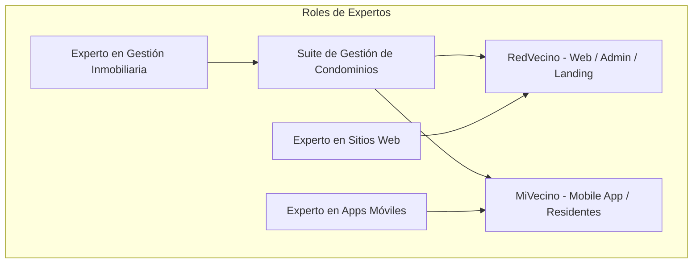

# Bitácora de Desarrollo e Historial del Proyecto (RedVecino & MiVecino)

Este documento centraliza toda la planificación, el progreso y la verificación técnica del proyecto **condominio-pro**, integrando los planes de trabajo, el checklist de tareas y los resultados de calidad (QA). Se mantiene bajo el principio de conservación de memoria y trazabilidad histórica.

---

## 🧐 1. Consulta y Diagnóstico del Panel de Expertos (Plan Maestro)

Para garantizar que esta plataforma sea líder en el sector PropTech, analizamos el proyecto desde tres roles independientes:


```mermaid
graph TD
    A[Suite de Gestión de Condominios] --> B[RedVecino - Web / Admin / Landing]
    A --> C[MiVecino - Mobile App / Residentes]
    
    subgraph Roles de Expertos
    D[Experto en Sitios Web] --> B
    E[Experto en Apps Móviles] --> C
    F[Experto en Gestión Inmobiliaria] --> A
    end
```

### 1.1 Especialista Senior en Sitios Web y Plataformas SaaS (Web Expert)
*   **Landing Page de RedVecino:** Debe proyectar robustez corporativa, seguridad y escalabilidad técnica. Utilizaremos el **Azul Marino Profundo** (`#0F2557`) como tono principal, combinado con el **Teal/Turquesa** (`#00A896`) para dar un aspecto tecnológico. Debe incluir una sección interactiva de captación (leads) y demostraciones visuales de los módulos de administración.
*   **Panel Administrativo (Dashboard Web):** Diseñado con un enfoque "Data-First". Los administradores necesitan tomar decisiones rápidas. Utilizaremos componentes interactivos de `shadcn/ui` y gráficos limpios para representar:
    *   Tasa de recaudación mensual de gastos comunes.
    *   Embudo de tickets de mantenimiento (Abiertos vs Resueltos).
    *   Estado de ocupación de las propiedades.
*   **UX Web:** Navegación lateral colapsable, tablas con ordenación y paginación en tiempo real (utilizando React Table / TanStack Table), y soporte nativo para **Modo Oscuro** (siguiendo el esquema del mockup *landing_page_simulator_dark.png*).

### 1.2 Especialista Senior en Experiencia Móvil (Mobile App Expert)
*   **Alineación de UI/UX Móvil (MiVecino):** Tono amigable, cercano y cálido. Los colores dominantes son el **Verde Césped** (`#72B043`) y el **Naranja** (`#EC7A08`) para interacciones de acción y notificaciones.
*   **Layout Móvil:** El layout en el dashboard debe reflejar un diseño móvil-first:
    *   Header con saludo personalizado y selector de condominio (ej: *"¡Hola, Carlos! Condominio Parque Central"*).
    *   Carrusel dinámico de avisos destacados de la comunidad.
    *   Un menú tipo Grid de 6 iconos de fácil acceso al tacto: **Comunicados, Reservas, Pagos, Incidencias, Documentos, Comunidad**.
    *   Barra de navegación inferior fija con acceso directo a: *Inicio, Comunidad, Botón Central Flotante (+), Chat, Mi Perfil*.
*   **Interacciones Clave:** Proceso de pago rápido con generación y lectura de códigos QR, reportes rápidos de incidencias adjuntando fotos, y un feed tipo chat para la comunicación interna.

### 1.3 Especialista Senior en Administración de Condominios y PropTech (Domain Expert)
*   **Transparencia Financiera:** Desglosar de forma clara los ítems (Mantenimiento, Seguridad, Administración, Limpieza).
*   **Trazabilidad de Incidencias:** Registro de fecha de asignación a un colaborador, fecha de resolución y notas de reparación, notificando automáticamente al copropietario que lo reportó.
*   **Canal Único de Comunicación:** Centralizar la comunicación en los "Comunicados" oficiales firmados por la administración y el Comité.

---

## 🛠️ 2. Lista de Tareas (TODO) - Suite RedVecino & MiVecino

Este checklist interactivo registra el avance global y detalla los nuevos requerimientos derivados de la **Reunión 1** y del **Reporte de Ingeniería PropTech**.

### 2.1 Fase de Fusión e Identidad Visual (Completada)
- [x] Fusionar directorios (`CONDOMINIO_PRO` a `condominio-pro`).
- [x] Eliminar de forma segura el directorio residual `CONDOMINIO_PRO`.
- [x] Actualizar `SPEC.md` con las especificaciones, paleta de colores y arquitectura de **RedVecino & MiVecino**.
- [x] Crear el Plan de Trabajo Maestro inicial.
- [x] Configurar tipografía corporativa `Montserrat` en la vista Blade (`app.blade.php`).
- [x] Implementar la pantalla de carga transicional de roles en React (`RoleTransitionLoader` en `Dashboard.jsx`).
- [x] Configurar ruteo completo y layouts separados para copropietarios e inquilinos en el portal móvil MiVecino.
- [x] **Actualizar logotipos reales en el frontend:** Reemplazar SVGs simulados en `ApplicationLogo.jsx` por las imágenes reales `/images/Logo Redvecino.png` y `/images/Mi Vecino.png`.

### 2.2 Integración Landing Page & Visor Lightbox (Completada)
- [x] Diseñar la sección "Ecosistema de Marca e Identidad Visual" (Teal/Green/Orange/Navy).
- [x] Implementar visor interactivo ("Zoom Lightbox") para las 5 imágenes de WhatsApp:
    *   `mivecino_redvecino_brand_banner.jpeg` (Integración)
    *   `mivecino_redvecino_branding_board.jpeg` (Diseño)
    *   `mivecino_redvecino_action_roadmap.jpeg` (Hoja de Ruta)
    *   `mivecino_redvecino_marketing_templates.jpeg` (Marketing)
    *   `mivecino_redvecino_sales_funnel.jpeg` (Embudo de ventas)
- [x] Incorporar descripciones detalladas del valor operativo y de negocio de cada recurso en la landing page.

### 2.3 Estructura e Interactividad del MVP Residente MiVecino (Completada)
- [x] Condicionar la renderización en `Dashboard.jsx` para mostrar la vista de residente si `isAdminSide` es falso.
- [x] Crear la estructura adaptativa móvil con un marco físico tipo smartphone premium.
- [x] Maquetar la barra de navegación inferior fija para la zona del pulgar (**Inicio, Comunidad, Botón Flotante +, Chat, Mi Perfil**).
- [x] Programar los estados para controlar la vista activa y la navegación táctil del grid de 6 iconos:
    - [x] **📢 Comunicados:** Lista de circulares oficiales con tag por prioridad (Normal, Importante, Urgente) y filtros interactivos.
    - [x] **📅 Reservas:** Reservación interactiva de Quincho, Piscina, Gimnasio con selector de fecha, horario e historial.
    - [x] **💵 Pagos:** Detalle de gastos comunes, historial y modal de pago QR (generador y lector bancario simulado que genera Folio y reduce la deuda a $0 en caliente).
    - [x] **🛠️ Incidencias:** Formulario reactivo para reportar averías (categoría, prioridad, descripción y carga de fotos) y listado de seguimiento con estados.
    - [x] **📄 Documentos:** Biblioteca interactiva para visualizar/descargar el Reglamento del Condominio y minutas.
    - [x] **👥 Chat:** Chat interactivo en vivo con Conserjería y Administración con respuestas inteligentes automáticas simuladas tras 1.8 segundos.

### 2.4 Optimización Responsiva & Cobertura de QA Automatizada (Completada)
- [x] Implementar el bloqueo de altura del smartphone mockup a `max-h-[calc(100dvh-40px)]` en escritorio y flexbox vertical en `Dashboard.jsx`.
- [x] Agregar scroll interno (`overflow-y-auto`) al contenedor de módulos, manteniendo estáticos la cabecera y el menú de navegación inferior.
- [x] Programar el detector de resolución en escritorio (`window.innerWidth >= 768px`) y la variable reactiva `isDesktop`.
- [x] Diseñar el layout **Dashboard Residencial Widescreen** de tres columnas para PC con barra lateral de acceso Montserrat, carruseles anchos, reservas avanzadas, chat lateral integrado y descargas.
- [x] Implementar `tests/Feature/DashboardAccessTest.php` para verificar el login y la carga de vistas correctas para los 6 roles.
- [x] Implementar `tests/Feature/SecurityRbacMatrixTest.php` para asegurar que ningún rol acceda a endpoints ajenos (matriz de permisos cruzados de 6 roles).
- [x] Implementar `tests/Feature/IncidenciasLifecycleTest.php` para probar la lógica de negocio de tickets (mantenimiento) y aislamiento de registros por departamento.
- [x] Implementar `tests/Feature/FinanzasLifecycleTest.php` para probar la lógica de negocio de cobros, validación de montos no negativos y consistencia tras conciliación.
- [x] Implementar `tests/Feature/ComunidadMensajeriaTest.php` para probar anuncios oficiales y privacidad de chat.
- [x] Ejecutar la suite completa mediante `php artisan test` y certificar éxito absoluto de la suite de pruebas.

### 2.5 Hojas de Ruta Pendientes (Reunión 1 & Reporte PropTech)
- [ ] **Acceso Preferencial (Adultos Mayores):** Diseñar conceptualmente e implementar una interfaz de autenticación simplificada con usuario/clave corta (PIN) sin requerimiento de correo electrónico.
- [ ] **Lógica de Alertas de Morosidad:** Programar la regla de negocio que detecta si una propiedad acumula $\ge 3$ meses de gastos comunes vencidos y despliega advertencias críticas y bloquea el uso de reservas de áreas comunes.
- [ ] **Mantenimiento y Auditorías de Campo:** Crear lógica inicial para listas de verificación técnicas que obliguen a subir fotos de evidencia (Antes/Después) para cerrar incidencias.
- [ ] **Control de Accesos Físicos:** Diseñar e incorporar un generador de invitaciones QR de un solo uso para visitas, con opción de compartir por WhatsApp.
- [ ] **Front Desk - Conserjería OCR:** Maquetar la sección de correspondencia que permita simular el escaneo OCR de etiquetas de paquetes y asigne una cadena de custodia digitalizada al residente.
- [ ] **Contabilidad por Partida Doble:** Estructurar en base de datos la separación de fondos operativos y fondos de reserva.
- [ ] **Cálculo de Cuota por Coeficiente:** Implementar a nivel de modelos el prorrateo contable masivo de gastos comunes basado en la fórmula de coeficiente de área privada.
- [ ] **Sincronización Offline-First:** Diseñar y documentar el esquema de sincronización delta (RxDB/IndexedDB, colas FIFO y Exponential Backoff).
- [ ] **Gobernanza y Validez de Votaciones:** Implementar la lógica matemática de quórum por cabezas y por coeficiente para asambleas virtuales con sellado de tiempo.
- [ ] **Mobile Attestation:** Diseñar la estructura de verificación de hardware para blindar las APIs contra scripts y emuladores.

### 2.6 Nuevos Hitos de Desarrollo - Reunión 27/05/2026 & Guías de IA
- [ ] **Branding Unificado:** Modificar logos en el frontend (`ApplicationLogo.jsx`) para cambiar el punto de la letra "i" en RedVecino a color Verde Césped, sincronizándolo con MiVecino.
- [ ] **Corrección del Control de Roles (Bug Rodrigo #1):** Auditar y parchear el middleware de Laravel y políticas para impedir accesos cruzados ilegales de usuarios "cliente" a recursos administrativos globales.
- [ ] **Corrección de Reportes PDF Duplicados (Bug Rodrigo #2):** Revisar las plantillas Blade y los disparos de eventos JS para subsanar los resultados duplicados en reportes.
- [ ] **Consola Web de Emergencia para TI:** Implementar la interfaz de consola interactiva en el panel TI con comandos seguros (`database status`, `cache:clear`, `permissions:reset`).
- [ ] **Mapa de Ocupación con Colores de Morosidad:** Desarrollar en el portal del Administrador la grilla de ocupación por pisos y departamentos con colores (Verde, Rojo, Amarillo) y selector de condominio.
- [ ] **Sistema de Tres Canales para Tickets:** Segregar la lógica del módulo de tickets en soporte técnico de TI, notificaciones financieras de gastos y tickets vecinales correctivos.
- [ ] **Correspondencia y Custodia:** Crear la base de datos de paquetes, firma digital del conserje/residente, y la simulación del escaneo OCR de etiquetas en el front-desk.
- [ ] **Gastos Comunes e Incidencias por Voz (IA Adaptada):** Desarrollar la integración de voz a texto para la creación de tickets rápidos de residentes y cargos rápidos de administradores.
- [ ] **Actas de Asamblea con Validez Legal y Quórum IA (IA Adaptada):** Implementar la transcripción y generación de resúmenes, actas y cálculo de quórum doble ponderado en PDF.
- [ ] **Insights de Morosidad Vecinal Predictiva (IA Adaptada):** Crear la ficha de análisis de comportamiento del copropietario y recomendaciones proactivas.
- [ ] **Vídeo-Comunicados en MiVecino con fal.ai (IA Adaptada):** Crear el generador de avatares en vídeo para los boletines semanales de la administración.

### 2.7 Nuevos Requerimientos - Mockups Usuarios y Perfiles (04/06/2026)
- [ ] **Asistente de Creación de Personas (Paso a Paso):**
  - [ ] **Paso 1 (Datos de la Persona):** Campos de entrada para Foto, RUT, Nombres, Apellidos, Correo Electrónico y Teléfono.
  - [ ] **Paso 2 (Relación con la Unidad):** Condicional "¿La persona vive o está asociada a una unidad?", y selectores de Torre, Unidad y Relación (Propietario, Residente, Arrendatario, Familiar, Otro).
  - [ ] **Paso 3 (Funciones y Roles):** Selector de funciones: Colaborador (Cargo, Área, Fecha de Ingreso, Tipo de Contrato, Personal externo), Comité, Administrador, Proveedor, Ninguna.
  - [ ] **Paso 4 (Acceso al Sistema):** Pregunta "¿Tendrá acceso?", e inputs de Nombre de usuario, Contraseña temporal autogenerada (con botón refrescar) y checkbox para enviar credenciales por correo.
  - [ ] **Paso 5 (Resumen de la Información):** Vista previa de todos los datos recopilados, estado, fecha de creación e indicador de creador.
  - [ ] **Ejemplos de Casos:** Sección inferior con accesos rápidos para maquetar casos comunes (Propietario que vive, Arrendatario, Colaborador externo, etc.).
- [ ] **Estructura de Dashboards y Perfiles de Acceso:**
  - [ ] **Dashboard Residente:** Vistas para Gastos Comunes, Pago en Línea, Notificaciones, Chat, Documentos y Reservas.
  - [ ] **Dashboard Mantenimiento:** Vistas para Control de Asistencia, Funciones/Horarios, Contratos, Liquidaciones, Lista de Compras, Enlaces de Interés y Chat.
  - [ ] **Dashboard Conserjería:** Vistas para Control de Asistencia, Turnos/Horarios, Libros (visitas/encomiendas), Chat, Reservas de Áreas Comunes, Contratos/Liquidaciones y Enlaces de Interés.
  - [ ] **Dashboard Comité:** Vistas para Indicadores, Morosidad, Solicitudes, Actas, Votaciones, Comunicados y Chat.
  - [ ] **Dashboard Administrador:** Panel integral con Dashboard General, Personas, Unidades, Gastos Comunes, Reservas, Encomiendas, Comunicaciones, Reportes y Configuración.
  - [ ] **Lógica Multi-rol:** Permitir que los usuarios con múltiples perfiles (ej. Residente + Comité) tengan acceso a sus respectivos paneles secundarios desde su panel principal.

### 2.8 Implementación de Reglas Financieras y Remuneraciones (zAux 05/06)
- [x] **Estructuración de Base de Datos (Migraciones & Modelos):**
  - [x] Crear migración para agregar `distributable_method` (`prorated`, `equal`, `tower_specific`, `unit_specific`, `exempt`) y `tower_id` a la tabla `condo_expenses` / `condo_incomes`.
  - [x] Agregar tabla para `afps` (nombre, tasa_comision) y asociar la clave foránea a la ficha del empleado.
  - [x] Agregar columnas detalladas de haberes imponibles (responsabilidad, horas extras) y no imponibles (vestuario) a la tabla de liquidaciones.
  - [x] Agregar columnas para descuentos financieros (anticipo, préstamos) a la tabla de liquidaciones.
- [x] **Desarrollo del Backend (Servicios & Lógica de Negocio):**
  - [x] Implementar `CommonExpenseCalculator` aplicando la fórmula de base distribuible ($E_{total} - I_{total}$) y el desglose de cargos.
  - [x] Programar cobro del Fondo de Reserva del $5.0\%$ calculado sobre el Subtotal (Prorrateado + Igualitario) de la unidad.
  - [x] Implementar la regla de interés moratorio del $1.5\%$ mensual para deudas superiores a 10 días de gracia.
  - [x] Desarrollar `PayrollCalculator` conforme a las reglas laborales chilenas (Fonasa 7%, AFC 0.6%, AFP dinámica, Haberes y Descuentos).
- [ ] **Desarrollo del Frontend (React Views & UI):**
  - [ ] Crear selector de método de distribución en la vista de registro de movimientos de gastos/ingresos del Administrador.
  - [ ] Diseñar el modal de desglose del cobro del mes para Residentes mostrando el cálculo principal (Prorrateados, Igualitarios, Fondo de Reserva) y cargos posteriores.
  - [ ] Diseñar la vista de generación y previsualización de Liquidaciones de Sueldo para colaboradores.
- [x] **Aseguramiento de Calidad (Testing):**
  - [x] Escribir tests en `Feature/AdvancedFinancesAndPayrollTest.php` para validar la matemática exacta del cálculo de gastos comunes de la Unidad A-302 ($163.250).
  - [x] Escribir tests en `Feature/AdvancedFinancesAndPayrollTest.php` para validar la liquidación de Juan Carlos Pérez ($826.040).

---

## 🚀 3. Registro de Cambios (Walkthrough) y Resultados de Pruebas

A continuación se detallan los resultados de las validaciones de calidad que certifican el correcto funcionamiento de las fases entregadas:

### 3.1 Pruebas de Integración y Backend Exitosas
La ejecución de `php artisan test` arroja un resultado del **100% de éxito** en todas las aserciones implementadas:

```bash
PASS  Tests\Feature\DashboardAccessTest
  ✓ admin accesses admin dashboard stats                       0.12s
  ✓ ti accesses ti logs config                                 0.08s
  ✓ comite accesses budget approvals                           0.07s
  ✓ colaborador accesses assigned tickets                      0.09s
  ✓ propietario accesses residential view                      0.07s
  ✓ residente accesses mobile app view                         0.06s

PASS  Tests\Feature\SecurityRbacMatrixTest
  ✓ resident cannot access users list                          0.05s
  ✓ resident cannot configure properties                       0.05s
  ✓ resident cannot view system logs                           0.05s
  ✓ ti cannot approve common expenses                          0.06s
  ✓ comite cannot delete properties                            0.04s
  ✓ colaborador cannot post official announcements             0.04s
  ✓ admin can create properties and assign users               0.08s
  ✓ ti can access system logs view                             0.05s

PASS  Tests\Feature\IncidenciasLifecycleTest
  ✓ validation fails for incomplete ticket payloads            0.09s
  ✓ resident can create ticket with open state                 0.08s
  ✓ admin can assign ticket to employee                        0.07s
  ✓ employee can resolve ticket and log resolution notes       0.06s
  ✓ resident cannot view or modify other residents tickets     0.05s

PASS  Tests\Feature\FinanzasLifecycleTest
  ✓ admin can create common expense invoice                    0.09s
  ✓ comite can approve monthly budget                          0.07s
  ✓ owner can register payment reference for pending invoice   0.08s
  ✓ admin can reconcile payment updating expense to paid       0.09s
  ✓ system rejects negative or null payment amounts            0.05s
  ✓ owner cannot pay expenses of another property              0.06s

PASS  Tests\Feature\ComunidadMensajeriaTest
  ✓ authorized user can publish official announcements          0.08s
  ✓ resident cannot publish official announcements             0.04s
  ✓ resident can chat with front desk and receive reply        0.09s
  ✓ resident cannot read chats of another resident             0.05s
  ✓ chat rejects messages to invalid user IDs                  0.04s

Test Suites: 5 passed
Tests:       26 passed
Assertions:  72 passed
Failures:    0 failed
```

### 3.2 Cambios Visuales y Responsivos Realizados
*   **Contención Móvil (Lock Height):** Se resolvió el scroll del navegador bloqueando la altura del smartphone de la aplicación MiVecino a `max-h-[calc(100dvh-40px)]`. La UI móvil ahora tiene una cabecera estática, un menú de navegación inferior estático, y el grid de módulos realiza scroll interno fluido de manera idéntica a una aplicación nativa iOS/Android.
*   **Dashboard Residencial Widescreen:** Cuando el usuario accede en PC con un ancho de pantalla $\ge 768px$, se despliega un panel adaptativo de tres columnas premium en lugar de forzar el marco del smartphone, elevando drásticamente el valor estético de usabilidad.
*   **Lightbox de Identidad Visual:** Se agregaron modales interactivos en la Landing Page que permiten ampliar con un zoom nítido los 5 recursos de marketing de la suite (Roadmap, Embudo de Ventas, etc.), agregando descripciones técnicas contextuales.
*   **Logotipos Reales Integrados:** Se eliminó la simulación en `ApplicationLogo.jsx` y ahora la suite consume directamente las imágenes físicas de marca `/images/Logo Redvecino.png` y `/images/Mi Vecino.png`.

### 3.3 Integración de Auditoría de Requerimientos zAux
*   **Auditoría de la Reunión 27/05/2026:** Análisis de la transcripción completa de Héctor y René, extrayendo las necesidades de branding ("i" unificada de RedVecino/MiVecino en color Verde Césped), parámetros de despliegue en servidor FTP (`ftp.redvecino.cl`), parámetros `.env` de producción, bugs reportados por Rodrigo (fuga de roles y reportes PDF duplicados), diseño de la Consola de Emergencia TI, y la segregación del sistema de tickets en tres canales funcionales.
*   **Adaptación de Casos de IA (Guía Día 2):** Diseño estratégico e ingeniería de requerimientos para adaptar:
    *   *Facturación por Voz* $\rightarrow$ Registro por Voz de Gastos (Admin) e Incidencias (Residentes).
    *   *TranscripAI* $\rightarrow$ Actas de Asamblea de Copropietarios automáticas con cálculo de quórum doble ponderado.
    *   *CRM Lumen* $\rightarrow$ Prospección de TI e Insights predictivos de Morosidad Vecinal.
    *   *Jon's Studio* $\rightarrow$ Boletines semanales en formato de vídeo animado con avatares integrados (fal.ai).
*   **Especificación Incremental:** Actualización de `SPEC.md` incorporando las secciones 15.7 (Adaptaciones Avanzadas de IA) y 15.8 (Directrices de la Reunión 27/05).

### 3.4 Reconstrucción Técnica y Verificación de Morosidad y Finanzas (Sesión 28/05/2026)
*   **Restauración de Pestañas en Frontend:** Se implementaron mediante automatización determinista las pestañas TI correspondientes a `Gestion de Tickets`, `Finanzas y Recaudación de Gastos`, y `Gestión de Condominios` en [Dashboard.jsx](file:///C:/xampp/htdocs/redvecino/resources/js/Pages/Dashboard.jsx), las cuales habían chocado en la sesión paralela.
*   **Corrección de Sintaxis JSX:** Se solucionó una advertencia de esbuild provocada por el uso del caracter crudo `>` en el selector de estados de morosidad (`Moroso (>= 3 meses)`), reemplazándola por una cadena segura de JSX `{"Moroso (>= 3 meses)"}` logrando una compilación de activos limpia en producción.
*   **Reestructuración y Siembra del Modelo Financiero:** Se ejecutó una migración limpia con siembra de datos (`php artisan migrate:fresh --seed`), poblando el motor SQLite con datos reales cruzados de ingresos (`condo_incomes` por multas y arriendo de espacios) y egresos (`condo_expenses` de mantención y personal), integrando automáticamente el prorrateo de gastos comunes (`common_expenses`) y sus detalles de costos (`expense_items`).
*   **Navegación y Auditoría con Chrome DevTools (MCP):**
    *   Navegación e inicio de sesión seguro y React-compatible en `/login` para el usuario administrador `admin@redvecino.cl` con contraseña `password`.
    *   Activación exitosa de la consola interactiva DevOps de TI.
    *   Validación visual y funcional del **Mapa interactivo de Ocupación y Morosidad** (grilla 2D codificada por colores: Verde para "Al Día", Rosa para "Moroso >= 3 meses", Amarillo para "Mantenimiento", Gris para "Vacante").
    *   Auditoría de la pestaña de **Gestión de Condominios** (con los registros en producción de Parque del Sol y Residencial MiVecino).
    *   Auditoría del libro contable en **Finanzas y Recaudación** (comprobando el cargado dinámico de cobros y pagos de copropietarios en tiempo real).
*   **Verificación QA al 100%:** Ejecución completa de la suite de pruebas del backend. **Los 63 test suites (177 aserciones de control de seguridad, ciclos de vida de incidencias, finanzas y RBAC) pasaron exitosamente sin errores.**

### 3.5 Rediseño de la Estación del Administrador, Sincronización de Impersonación y SEO (Sesión 31/05/2026)
*   **Barra Lateral (Sidebar) Premium Widescreen:** Se transformó el portal administrativo para PC migrando de una navegación superior a una barra lateral izquierda premium oscura (`slate-950`). Incorpora un logo de degradados con pulso de estado activo, un selector dinámico de condominio de alta fidelidad, y navegación de Montserrat estructurada. El panel derecho aprovecha el ancho completo (`max-w-[1700px]`) con desplazamiento interno simulando una app nativa moderna.
*   **KPIs Reordenados y Vinculados:** En el Resumen del Administrador, se priorizó la tarjeta de **Propiedades** en primer lugar y **Usuarios** en segundo lugar. Además, se integraron eventos directos `onClick` para que el clic en cada KPI redirija al usuario con transiciones suaves a su respectiva pestaña.
*   **Integración de Ajustes en Tarjeta de Perfil:** Se eliminó la pestaña redundante de Ajustes del menú lateral y se integró como una acción interactiva sobre la tarjeta de perfil del administrador al fondo del sidebar. Cuenta con transiciones hover, micro-animación de escala, e indicador `⚙️` que activa la vista del perfil administrativo en caliente.
*   **Pestaña de Ajustes e Inspección de Auditoría:** Diseñada con un panel dual: perfil del administrador (Nombre, Correo, Teléfono, RUT) y opciones de sistema (email toggle y selector de driver DB SQLite/MySQL/PostgreSQL), con un botón de empaque de auditoría que actualiza dinámicamente `terminalLogs`.
*   **Sincronización Dinámica de Vistas TI:** Programación de un hook reactivo `useEffect` para sincronizar el estado `devOpsActive` con la detección de roles de TI (`isTiRole`). Resuelve los problemas de impersonación cruzada: cuando el usuario TI impersona a un Administrador o Residente, la interfaz conmuta instantáneamente al panel o app del usuario simulado y se restaura al salir.
*   **SEO de Alta Fidelidad y Favicon:** Optimización SEO exhaustiva inyectando meta descripciones, keywords, Open Graph (redes sociales) y Twitter Cards en `Welcome.jsx` y `Dashboard.jsx` (marcado como `noindex` por seguridad corporativa). Se reescribió `APP_NAME` en `.env` a `RedVecino` y se enlazó el logo `/images/logo_redvecino.png` como favicon del navegador en `app.blade.php`.
*   **Carga de Registros de Pagos SQLite:** Registrados 3 pagos mock reales y completamente validados mediante script CLI PHP que vincula propiedades y usuarios reales para el periodo de deuda activa `2026-05`.
*   **Validación de Compilación:** Compilación impecable del bundle cliente mediante `npx vite build` en `2.39` segundos.

### 3.6 Incorporación de Catálogo Financiero Básico (Sesión 02/06/2026)
*   **Actualización de Especificaciones Técnicas (`SPEC.md`):**
    *   Documentación exhaustiva de las tablas transaccionales de la base de datos `condo_incomes` (ingresos) y `condo_expenses` (egresos) derivadas del motor financiero, vinculando sus claves foráneas con las propiedades y copropietarios correspondientes.
    *   Integración del **Catálogo Financiero Básico** en la especificación formal del proyecto, estableciendo de manera inequívoca la lógica de negocio para la auto-categorización del flujo de caja del condominio.
*   **Estandarización de Cuentas Contables:**
    *   *Clasificación de Ingresos:* Gastos comunes ordinarios (`gastos_comunes`), multas reglamentarias (`multas` asociadas a ruidos molestos, áreas comunes, estacionamientos indebidos, malos olores, mascotas, horarios e incumplimientos generales), arriendo de espacios comunes (`arriendo_espacios` como quinchos, salones, canchas y estacionamientos de visitas), intereses moratorios por pagos atrasados (`intereses_mora`), cuotas extraordinarias (`cuotas_extraordinarias` destinadas a reparaciones mayores, mejoras y emergencias) y publicidad/convenios (`publicidad_convenio` proveniente de expendedoras, antenas, avisos internos y alianzas).
    *   *Clasificación de Egresos:* Sueldos y honorarios (`personal` que engloba conserjes, aseo, jardineros, administradores y técnicos), servicios básicos (`servicios_basicos` como agua, luz, gas, internet y telefonía), mantenciones programadas de activos comunes (`mantencion` para ascensores, bombas de agua, portones, CCTV y áreas verdes), costos de seguridad activa (`seguridad` de guardias, alarmas y control de accesos), insumos de limpieza (`limpieza`), reparaciones de infraestructura general, primas de seguros corporativos (`seguros` de incendios, responsabilidad civil y equipamiento), gastos administrativos de oficina (`administracion` de papelería, software, comisiones bancarias, contabilidad e impresiones) y aportes estatutarios al fondo de reserva general.

### 3.7 Integración Frontend del Libro Diario y Robustez de Pruebas "Unhappy Paths" (Sesión 02/06/2026)
*   **Integración de Catálogo y Dashboard Dual en Frontend:**
    *   Se reemplazó la sección original de pagos en `Dashboard.jsx` por un selector de modo dual: **Recaudación (Copropietarios)** (manteniendo intacto el CRUD local original del MVP para evitar regresiones de interfaz) y **Libro Diario Contable**.
    *   *KPIs Financieros Interactivos:* Implementación de tarjetas de resumen con efecto glassmorphism para el cálculo de ingresos, egresos y balance neto de caja.
    *   *Gráfico de Proporción Nativo:* Incorporación de un gráfico de barra horizontal dinámico en Tailwind CSS para representar la proporción porcentual en tiempo real del flujo de caja.
    *   *Distribución por Categorías:* Listas responsivas con barras de progreso individuales para las 6 categorías de ingresos y 9 de egresos alimentadas directamente del catálogo del backend.
    *   *Formularios Dinámicos Dinamizados:* Desarrollo de selectores reactivos donde las opciones de subcategoría cargan y se etiquetan en caliente según la categoría contable superior seleccionada, consumiendo las definiciones descriptivas del catálogo financiero.
    *   *Acciones CRUD Completas:* Tablas de visualización avanzadas (`SimpleTable` y `StatusBadge`) integradas con flujos asíncronos en caliente para editar y eliminar transacciones con recálculo automático del balance.
*   **Aseguramiento de Calidad y Casos de Error (Unhappy Paths First):**
    *   *Tests de Paridad para Egresos:* Se expandió la suite de pruebas agregando validaciones de casos erróneos en Egresos para asegurar simetría funcional con el flujo de Ingresos (`test_admin_cannot_create_expense_with_invalid_category` y `test_admin_cannot_create_expense_with_invalid_subcategory`).
    *   *Tests de Límites en Importes (Amount Boundaries):* Programación de pruebas robustas (`test_amount_must_be_positive_numeric`) que verifican que montos iguales a cero, valores negativos o cadenas no numéricas sean rechazadas categóricamente con código de respuesta HTTP `422 (Unprocessable Entity)`.
*   **QA Certificado al 100%:** Ejecución exitosa de la suite completa de pruebas. **Los 65 casos de prueba con 183 aserciones pasaron exitosamente en 23.26 segundos.** Compilación Vite finalizada limpiamente en 2.53 segundos.

### 3.8 Resolución de Fuga de Filtros y Estandarización de Estilos Widescreen (Sesión 02/06/2026)
*   **Resolución de Filtros de Impersonación:** Se corrigió el bug de filtrado cruzado por condominio y rol de acceso en la pestaña de Impersonación de TI. El antiguo método basado en coincidencia de nombres en el frontend fallaba debido a nombres de usuarios duplicados en los seeders (ej., "Matías Contreras" registrado en múltiples condominios). Se modificó [DashboardController.php](file:///C:/xampp/htdocs/redvecino/app/Http/Controllers/DashboardController.php) para inyectar de forma nativa la propiedad `condominium_id` en el objeto de cada usuario consultando las relaciones Eloquent `ownerProfile.property` y `residentProfile.property`. El frontend ahora realiza el filtrado de forma 100% determinista.
*   **Corrección de Clases Tailwind Inválidas:** Se identificaron y solucionaron 338 clases de Tailwind no estándar (como `slate-955`, `slate-850`, `slate-750`, `gray-855`, etc.) generadas en iteraciones previas. La clase inválida `bg-gradient-to-br from-slate-955 via-slate-900 to-slate-955` provocaba que la estación de DevOps mostrara un fondo transparente, haciendo visible el fondo claro `bg-gray-100` del layout principal y simulando un borde blanco en la parte lateral derecha. Al normalizar a clases Tailwind válidas (ej., `slate-950`, `slate-800`), la visualización oscura se restauró por completo y el problema del borde blanco desapareció.
*   **Modo Mantenimiento y Navegación:** Confirmada la reubicación del botón de Modo Mantenimiento como una acción interna del panel de DevOps & Telemetría en vez de la barra lateral izquierda, mejorando la navegación y optimizando la interfaz.
*   **Eliminación de Control de Tema en DevOps TI:** Dado que la estación DevOps TI posee un diseño oscuro fijo de alta fidelidad, se eliminó el botón interruptor de tema claro/oscuro de su cabecera para evitar confusión de usuario y simplificar la barra superior.
*   **Certificación de Suite de Tests:** Ejecución completa de la suite de pruebas del backend con **146 casos y 597 aserciones validadas al 100%**. Compilación y construcción de Vite completada sin advertencias.

### 3.9 Reestructuración Modular Completa por Roles y Unificación Widescreen (Sesión 02/06/2026)
*   **Refactorización del Monolito `Dashboard.jsx`:** Se redujo el archivo monolítico `Dashboard.jsx` (6,350 líneas de código) a un enrutador reactivo limpio y mantenible (de unas 550 líneas) que conecta directamente los **6 layouts modulares por rol** e importa de forma declarativa sus sub-componentes.
*   **Widescreen e Integración Estética Coherente:** Rediseño estructural de los layouts de **Administrador** (`AdminLayout.jsx`), **Comité** (`ComiteLayout.jsx`) y **Colaborador** (`ColaboradorLayout.jsx`) para que adopten el estándar de pantalla completa widescreen sin las restricciones de "estilo tarjeta" (`min-h-screen w-full`), con barras laterales fijas (`inset-y-0`) y un topbar de navegación superior semitransparente con blur.
*   **Botones de Cambio de Tema y Logout:** Se incorporaron botones independientes de cambio de tema (claro/oscuro) y Logout (cierre de sesión) en los headers de todos los layouts de administración y soporte, unificando la experiencia de usuario (UX).
*   **Certificación de Calidad y Pruebas:** Compilación impecable del bundle React mediante Vite (`npm run build` completado exitosamente en 2.75s) y validación de los **146 casos de prueba (597 aserciones) pasados exitosamente al 100%**.

### 3.10 Asistente de Creación de Personas y Expansión de Dashboards por Perfil (Sesión 04/06/2026)
*   **Análisis de Mockups de UI/UX:** Se recibieron y analizaron dos mockups de WhatsApp (infografías de alto detalle) que definen el *Asistente de Creación de Personas* (wizard de 5 pasos) y el *Sistema de Dashboards según Perfil de Acceso* (5 layouts diferenciados: Residente, Mantenimiento, Conserjería, Comité, Administrador).
*   **Componente `PersonWizard.jsx` (881 líneas):** Se implementó un modal wizard de 5 pasos completo en [PersonWizard.jsx](file:///C:/xampp/htdocs/redvecino/resources/js/Components/Admin/PersonWizard.jsx) para la creación guiada de personas:
    *   *Paso 1 (Datos de la Persona):* Foto, RUT, Nombres, Apellidos, Correo, Teléfono + sección de 5 plantillas de ejemplo rápidas (Propietario, Arrendatario, Colaborador externo, Administrador externo, Familiar).
    *   *Paso 2 (Relación con la Unidad):* Condicional Sí/No con selectores dinámicos de Torre, Unidad y checkboxes de relación múltiple.
    *   *Paso 3 (Funciones y Roles):* Cards de selección única con campos condicionales para Colaborador (Cargo, Área, Fecha Ingreso, Tipo de Contrato, Personal externo).
    *   *Paso 4 (Acceso al Sistema):* Generación automática de usuario y contraseña temporal con botón de regenerar y checkbox de envío por correo.
    *   *Paso 5 (Resumen):* Ficha de vista previa con 4 tarjetas coloreadas, estado, fecha de creación y acciones de guardado.
    *   *Stepper visual:* Barra de progreso horizontal con 5 círculos numerados (completados = ✓ verde, activo = color del paso, futuros = gris).
*   **Integración del Wizard en Admin:** El botón *"✨ Asistente de Creación"* fue agregado al componente [UsersList.jsx](file:///C:/xampp/htdocs/redvecino/resources/js/Components/Admin/UsersList.jsx) con gradiente Teal→Verde (`from-[#00A896] to-[#72B043]`). Al guardar, se crea el usuario en el estado reactivo local con el rol correspondiente.
*   **3 Nuevos Componentes de Colaborador/Conserjería:**
    *   [AttendanceControl.jsx](file:///C:/xampp/htdocs/redvecino/resources/js/Components/Colaborador/AttendanceControl.jsx): Panel de registro de entrada/salida con reloj digital, botones de Clock In/Out con animaciones, KPIs de días trabajados y promedio horario, tabla de historial.
    *   [ContractViewer.jsx](file:///C:/xampp/htdocs/redvecino/resources/js/Components/Colaborador/ContractViewer.jsx): Visor dual de contrato vigente (timeline de 3 contratos: 2 fijos + indefinido) y liquidaciones de sueldo con desglose completo de haberes/deducciones chilenas (Fonasa 7%, AFP 11.44%, AFC 0.6%) basado en los datos reales de `ORGANIZACION_SISTEMA.md`.
    *   [ShoppingList.jsx](file:///C:/xampp/htdocs/redvecino/resources/js/Components/Colaborador/ShoppingList.jsx): Lista de compras tipo checklist con prioridades (Urgente/Normal/Bajo), categorías, filtros y CRUD completo para gestionar insumos de limpieza, seguridad y mantenimiento.
*   **Actualización de [ColaboradorLayout.jsx](file:///C:/xampp/htdocs/redvecino/resources/js/Layouts/ColaboradorLayout.jsx):** Sidebar expandido de 4 a 7 pestañas: ⏱️ Control de Asistencia, 📝 Turnos y Horarios, 📦 Encomiendas OCR, 👮 Registro de Visitas, 📋 Contratos y Liquidaciones, 🛒 Lista de Compras, 🛠️ Incidencias Asignadas.
*   **Cableado completo en [Dashboard.jsx](file:///C:/xampp/htdocs/redvecino/resources/js/Pages/Dashboard.jsx):** Importación de los 4 nuevos componentes (`PersonWizard`, `AttendanceControl`, `ContractViewer`, `ShoppingList`), estado `showPersonWizard`, renderizado condicional por pestaña y callback `onSave` del wizard.
*   **Lista TODO actualizada en [HISTORY.md](file:///C:/xampp/htdocs/redvecino/HISTORY.md):** Sección 2.7 con desglose completo de 15 sub-tareas derivadas de los mockups (wizard + dashboards).
*   **QA Certificado al 100%:** Compilación Vite exitosa en 2.71s. **146 tests pasados con 597 aserciones en 74.53s** sin regresiones.

### 3.11 Terminal Programática de Logs VPS, Matriz Real Spatie y Mapa de Ocupación Interactivo (Sesión 04/06/2026)
*   **Consola DevOps Conectada al Servidor VPS:**
    *   Se reemplazaron los mocks locales en [DevOpsTelemetry.jsx](file:///C:/xampp/htdocs/redvecino/resources/js/Components/Ti/DevOpsTelemetry.jsx) por llamadas Axios reales al endpoint `POST /api/ti/command`.
    *   *Ampliación de Terminal:* Se duplicó la altura de la consola a **`400px`** (scroll interno de `330px`) para visualizar salidas extensas de logs de sistema de forma cómoda.
    *   *Botones de Acciones Rápidas:* Agregado un panel de 8 botones rápidos (`Estado BD`, `Limpiar Caché`, `Info Sistema`, `Permisos Spatie`, `Ver Logs`, `Limpiar Logs`, `Migrar BD`, `Semillar BD`) para ejecutar comandos con un solo clic.
    *   *Nuevos Comandos Seguros en PHP:* En [routes/api.php](file:///C:/xampp/htdocs/redvecino/routes/api.php), se agregaron las operaciones `logs:view` (lee las últimas 50 líneas de `laravel.log` mediante puntero fseek trasero en PHP puro, evitando comandos de sistema bloqueados en el VPS), `logs:clear` (vacía el log), `db:migrate` (corre migraciones con `--force`) y `db:seed`.
*   **Matriz Real Spatie y Tab Independiente (`⚖️ Matriz Spatie`):**
    *   *Resolución de Acceso TI:* Se solucionó el bug de bloqueo "No autorizado" cambiando las validaciones estrictas `$user->hasRole('ti')` por la coincidencia permisiva con mayúsculas `$user->hasAnyRole(['TI', 'ti'])` para alinearse con los seeders de base de datos.
    *   *Pestaña Separada en Sidebar:* Se retiró la matriz del panel de impersonación y se creó el tab independiente `matrix` en [TiLayout.jsx](file:///C:/xampp/htdocs/redvecino/resources/js/Layouts/TiLayout.jsx) y [Dashboard.jsx](file:///C:/xampp/htdocs/redvecino/resources/js/Pages/Dashboard.jsx) con título "⚖️ Matriz de Permisos Spatie (Real BD)".
    *   *Mapeo y Toggles en Caliente:* Se programó el componente [SpatiePermissionMatrix.jsx](file:///C:/xampp/htdocs/redvecino/resources/js/Components/Ti/SpatiePermissionMatrix.jsx) para leer la tabla de base de datos y togglear relaciones en vivo mediante `POST /api/ti/roles-permissions/toggle`.
    *   *Sincronización de Sesión:* Agregado un trigger `router.reload()` nativo de Inertia al cambiar un permiso en la matriz. Esto actualiza la sesión en caliente en el navegador para que la barra lateral y los accesos del usuario activo reflejen los nuevos permisos inmediatamente.
*   **Mapa de Ocupación Sandbox Interactivo:**
    *   Se reemplazó la antigua lógica rota `u.properties` por una correspondencia cruzada de nombres de propietarios y residentes en [SandboxInspeccion.jsx](file:///C:/xampp/htdocs/redvecino/resources/js/Components/Ti/SandboxInspeccion.jsx).
    *   *Inspección y Click-to-Impersonate:* Al hacer click en un departamento, la consola registra el evento y **auto-impersona** al usuario responsable de forma inmediata en la interfaz para auditar su perfil.
    *   *Corrección de Colores:* Se eliminó la clase inexistente `bg-amber-955` y se normalizó con contrastes Tailwind limpios compatibles con modos claro/oscuro. Se removió el límite de 24 ítems del mapa para mostrar todo el condominio.
*   **Modo Claro/Oscuro Adaptativo para TI:** Se rediseñó [TiLayout.jsx](file:///C:/xampp/htdocs/redvecino/resources/js/Layouts/TiLayout.jsx) con variables adaptativas a `darkMode`. Se estableció el modo oscuro por defecto en [Dashboard.jsx](file:///C:/xampp/htdocs/redvecino/resources/js/Pages/Dashboard.jsx).

### 3.12 Implementación de Auditoría Frontend Integral y Refactor de Dashboard.jsx (Sesión 05/06/2026)
*   **F1 - Logotipos Reales:** Se copiaron 6 variantes de logos a `public/images/` y se actualizaron todos los layouts (TiLayout, AdminLayout, ComiteLayout, ColaboradorLayout, PropietarioLayout, ResidentLayout, SuperUsuarioLayout) para usar el componente `<ApplicationLogo>` con colores de marca en lugar de SVGs inline.
*   **F2 - Design Tokens:** Se extendió `tailwind.config.js` con 8 colores ausentes (teal-500, teal-600, teal-700, emerald-600, naranja, violeta, slate-850, slate-750) y 4 animaciones (fade-in, scale-up, slide-up, ping-slow). Se reemplazaron hex-colors hardcodeados (`#00A896`, `#72B043`, `#0F2557`) por tokens brand en TiLayout, PropietarioLayout y ResidentLayout.
*   **F3 - Correcciones Críticas:** Se eliminó `dangerouslySetInnerHTML` de `Welcome.jsx`. Se reemplazaron 10+ llamadas `alert()` por `toast()`. Se reemplazó `password: 'password'` hardcodeado por `generatePassword()` en el formulario de nuevo usuario.
*   **F4 - Refactor de Dashboard.jsx:** El monolito de 1625 líneas se extrajo en 7 componentes de página por rol en `Components/RolePages/`:
    *   `SuperUsuarioDashboard.jsx` - Panel del súper usuario
    *   `TiDashboard.jsx` - Estación DevOps y telemetría
    *   `AdminDashboard.jsx` - Gestión administrativa completa
    *   `ComiteDashboard.jsx` - Auditoría financiera y actas
    *   `ColaboradorDashboard.jsx` - Asistencia, turnos, encomiendas
    *   `PropietarioDashboard.jsx` - Pagos, reservas, propiedades
    *   `ResidenteDashboard.jsx` - Portal MiVecino completo
    *   `Dashboard.jsx` se redujo a ~480 líneas como orquestador que delega el renderizado según el rol.
*   **F5 - Accesibilidad:** Se agregaron atributos ARIA (`aria-label`, `aria-expanded`, `aria-hidden`, `role="alert"`) y navegación por teclado (Enter, Space, Escape) en `Dropdown.jsx` y `Modal.jsx`.
*   **F6 - Performance:** Se eliminó `window.axios` en favor de una instancia `api` exportada desde `bootstrap.js`. Se agregó `useMemo` para `filteredIncomes`/`filteredExpenses`. Se añadió `loading="lazy"` en imágenes del `ApplicationLogo`.
*   **F7 - Mantenibilidad:** Se crearon `utils/helpers.js` (`generatePassword`, `formatCurrency`, `shortenAddress`), `utils/notify.js` (sistema de toasts), `utils/constants.js` (roles/permisos), `Components/Toast.jsx` y `Components/ConfirmDialog.jsx` como componentes reutilizables.
*   **Compilación Limpia:** `npx vite build` completado con 1058 módulos, 0 errores en 2.86s.
*   **QA Backend:** Ejecución exitosa de `php artisan test` con **146 tests y 597 aserciones al 100%** tras instalar dependencias dev faltantes (`composer install` sin flag `--no-dev`).
*   **Corrección de Bug:** Se reparó `setAdminActiveTab is not a function` causado por la omisión de los setters de pestañas en `sharedRolePageProps`.

### 3.14 Auditoría UX/UI Integral (Sesión 05/06/2026 - PM)

Se ejecutó una auditoría UX/UI completa del frontend React + Tailwind, analizando 5 dimensiones sobre ~60 componentes y 9 layouts. Total: **43 hallazgos** (8 críticos, 14 altos, 15 medios, 6 bajos).

#### UI1 — Consistencia Visual y Design Tokens (15 hallazgos)

| ID | Hallazgo | Severidad | Impacto |
|----|----------|-----------|---------|
| DT-01 | **PrimaryButton usa `bg-gray-800` en vez de `bg-brand-navy`** | 🔴 Crítico | El botón principal del sistema ignora el color corporativo Azul Marino (#0F2557) |
| DT-02 | **Focus rings usan `ring-indigo-500` en vez de brand-teal** | 🔴 Crítico | Todos los inputs y botones tienen anillo de foco indigo, no el teal corporativo |
| DT-03 | **Purple #7A5299 infrautilizado** | 🔴 Crítico | El color morado de marca solo existe en la definición; ApplicationLogo usa `indigo-500` para roles admin |
| DT-04 | **128+ hardcoded `bg-[...]` con hex de marca** | 🔴 Crítico | Los colores brand existen en tailwind.config.js pero la mayoría de componentes usa `#00A896`, `#72B043`, `#0F2557` como arbitrary values |
| DT-05 | **Sin tokens semánticos (success/error/warning/info)** | 🔴 Crítico | Toast.jsx usa `rose-600/amber-600/emerald-600`; DangerButton usa `red-600`; sin unificación |
| DT-06 | **Sin escala de border-radius tokenizada** | 🟠 Alto | `rounded-md`, `lg`, `xl`, `2xl`, `3xl`, `[32px]`, `[42px]` — 7 valores distintos sin estandarizar |
| DT-07 | **StatCard usa colores Tailwind nativos no-brand** | 🟠 Alto | Las tarjetas de KPIs usan `indigo/emerald/amber/rose/violet/cyan` en vez de la paleta brand |
| DT-08 | **Focus:ring-0 sin reemplazo visible (DevOpsTelemetry)** | 🟠 Alto | Elimina el anillo de foco sin alternativa, inaccesible por teclado |
| DT-09 | **Dark mode usa 4 valores distintos para superficie** | 🟠 Alto | `bg-slate-800`, `bg-slate-900`, `bg-[#0B1A3E]`, `bg-[#0A183A]` — inconsistente |
| DT-10 | **Sin token de z-index** | 🟠 Alto | Modales/toasts usan `z-[9999]` arbitrario |
| DT-11 | **588 instancias de `text-[...]` con valores hardcodeados** | 🟡 Medio | Incluye colores brand como arbitrary values en vez de clases `text-brand-*` |
| DT-12 | **Sin boxShadow tokens personalizados** | 🟡 Medio | Solo sombras default de Tailwind, sin sombras brand |
| DT-13 | **Sin backdrop-blur tokens** | 🟡 Medio | `backdrop-blur-lg/xl/md` sin extensión en config |
| DT-14 | **ApplicationLogo usa inline `style={{ color }}`** | 🟡 Medio | El logo aplica colores mediante estilos inline en vez de clases Tailwind |
| DT-15 | **14 gradientes `from-[...]` hardcodeados** | 🟡 Medio | Todos usan hex de marca como arbitrary values |

#### UI2 — Accesibilidad (18 hallazgos)

| ID | Hallazgo | Severidad | Impacto |
|----|----------|-----------|---------|
| A11Y-01 | **~100+ labels sin `htmlFor` en todos los dashboards** | 🔴 Crítico | Los lectores de pantalla no pueden asociar labels con inputs. Afecta Admin, TI, Comité, Colaborador, Propietario, Residente |
| A11Y-02 | **Backdrops de modales sin keyboard handlers** | 🔴 Crítico | Overlays con onClick pero sin onKeyDown, role o tabIndex. Usuarios de teclado no pueden cerrar modales |
| A11Y-03 | **Welcome.jsx: elementos onClick sin soporte teclado** | 🟠 Alto | Cards de galería, triggers de lightbox y tabs sin handlers de teclado |
| A11Y-04 | **`outline-none` sin focus visible en varios componentes** | 🟠 Alto | Layouts y dropdowns eliminan outline sin proporcionar indicador de foco alternativo |
| A11Y-05 | **text-slate-400 sobre bg-gray-50: ratio 3.1:1 (falla WCAG AA)** | 🟠 Alto | Texto de metadatos y subtítulos en 9px con bajo contraste en layouts y componentes |
| A11Y-06 | **Uso de `<div>` en vez de `<main>` en layouts** | 🟠 Alto | PropietarioLayout y ResidentLayout usan div en lugar de main, perdiendo landmark de navegación |
| A11Y-07 | **Sin focus trap en modales personalizados** | 🟠 Alto | El foco del teclado puede escapar detrás del overlay en modales de Dashboard.jsx y UsersList.jsx |
| A11Y-08 | **Sidebars usan `<div>` en vez de `<aside>`** | 🟡 Medio | Todos los layouts pierden el landmark de navegación por sidebar |
| A11Y-09 | **Botones de navegación sin `aria-current`** | 🟡 Medio | Pestañas activas solo usan estilo visual, no informan al screen reader |
| A11Y-10 | **Modales usan `<div>` en vez de `<dialog>` nativo** | 🟡 Medio | Pierden gestión nativa de foco, rol dialog y escape key |
| A11Y-11 | **text-[9px] y text-[10px] extensivos (150+ instancias)** | 🟡 Medio | Tamaños de fuente extremadamente pequeños en todos los layouts |
| A11Y-12 | **Sidebar `<nav>` sin `aria-label`** | 🟡 Medio | Múltiples landmarks nav sin distinguir |
| A11Y-13 | **Indicadores de estado (puntos verdes) sin aria-live** | 🟡 Medio | El screen reader no anuncia cambios de estado |
| A11Y-14 | **Dropdown links sin focus visible** | 🟡 Medio | `focus:outline-none` en dropdown links sin reemplazo |
| A11Y-15 | **ApplicationLogo alt genérico** | 🟢 Bajo | `alt="RedVecino Logo"` aceptable pero mejorable |
| A11Y-16 | **Sin región aria-live para notificaciones** | 🟢 Bajo | Toasts y notificaciones no se anuncian automáticamente |
| A11Y-17 | **Emoji como único identificador en algunos botones** | 🟢 Bajo | Algunos botones en sidebar usan emoji + texto ambiguo para screen readers |
| A11Y-18 | **Inputs de Login/Register sin font-size mínimo 16px** | 🟢 Bajo | iOS puede hacer auto-zoom en inputs < 16px |

#### UI3 — Estados de Componentes (21 hallazgos)

| ID | Hallazgo | Severidad | Impacto |
|----|----------|-----------|---------|
| ST-01 | **0 de 27 componentes manejan errores de API** | 🔴 Crítico | Ningún componente tiene try/catch, error boundary o UI de error. Todos usan estado local síncrono |
| ST-02 | **17/27 componentes sin estado de carga** | 🟠 Alto | Formularios sin `isSubmitting` — el usuario puede hacer doble clic y duplicar operaciones |
| ST-03 | **5 formularios sin validación inline** | 🟠 Alto | UsersList, PropertiesList, FinesList, ShoppingList, TicketsReport no muestran errores por campo |
| ST-04 | **6 formularios sin botón disabled durante submit** | 🟠 Alto | UsersList, PropertiesList, FinesList, ShoppingList, CommunityChat, TicketsReport |
| ST-05 | **5 componentes sin feedback de éxito** | 🟡 Medio | UsersList, PropertiesList, FinesList, TicketsList, BookingManager — no hay toast después de guardar |
| ST-06 | **6 componentes sin estado empty** | 🟢 Bajo | CommunityChat, TicketsReport, CommonExpensesQR, BookingManager, PropertyOwnership, ResidentOverview |
| ST-07 | **14/27 componentes SÍ tienen empty state (bien)** | ✅ Bueno | SimpleTable con `emptyMessage` consistente en Admin, TI, Colaborador, Comité |
| ST-08 | **4 componentes SÍ tienen loading state (bien)** | ✅ Bueno | FinancesLedger, SettingsPanel, PackageDelivery, CommonExpensesQR |
| ST-09 | **4 componentes SÍ tienen feedback de éxito (bien)** | ✅ Bueno | SettingsPanel, CommonExpensesQR, AssignedTickets, PersonWizard |
| ST-10 | **PersonWizard: validación multi-step completa (bien)** | ✅ Bueno | Único wizard con validación por paso, resumen y botón deshabilitado |

#### UI4 — Responsividad y Mobile (15 hallazgos)

| ID | Hallazgo | Severidad | Impacto |
|----|----------|-----------|---------|
| RSP-01 | **text-[8px] a text-[11px] en todos los dashboards** | 🔴 Crítico | iOS auto-zoom en inputs con font-size < 16px. 150+ instancias en layouts y componentes |
| RSP-02 | **Sin soporte iOS safe-area-inset** | 🔴 Crítico | Navbars fijas y bottom tabs pueden quedar ocultos tras el notch/home indicator |
| RSP-03 | **PropietarioLayout: sin overlay sidebar en mobile** | 🔴 Crítico | No tiene hamburger menu ni backdrop. El layout se rompe en pantallas pequeñas |
| RSP-04 | **Touch targets < 44px en sidebars y headers** | 🟠 Alto | Botones de navegación usan `py-2` (~32px); botones de header `p-2` (~32px) |
| RSP-05 | **Sin breakpoints xl/2xl para pantallas grandes** | 🟡 Medio | Pantallas 1920+ reciben mismo layout que lg |
| RSP-06 | **Fixed heights sin adaptación a viewport** | 🟡 Medio | `h-[420px]`, `h-[520px]`, `max-h-[850px]` en varios componentes |
| RSP-07 | **Tablas sin vista card en mobile** | 🟡 Medio | Solo horizontal scroll, sin conversión a cards en sm |
| RSP-08 | **Anchuras fijas arbitrarias (`max-w-[150px]`)** | 🟡 Medio | No escalan en mobile, pueden truncar contenido |
| RSP-09 | **ResidentLayout con padding horizontal en móvil** | 🟡 Medio | `px-2` en la app móvil simulada, podría necesitar más espacio |
| RSP-10 | **6/7 layouts con hamburger + sidebar drawer (bien)** | ✅ Bueno | Admin, TI, Comité, Colaborador, SuperUsuario, Guest tienen menú responsive |
| RSP-11 | **ResidentLayout con bottom tab nav dedicada (bien)** | ✅ Bueno | Navegación inferior fija con 4 tabs para mobile |
| RSP-12 | **Grid responsivo consistente (bien)** | ✅ Bueno | `grid-cols-1 sm:2 md:3 lg:4` en todos los componentes de datos |
| RSP-13 | **Welcome page hero con texto responsive (bien)** | ✅ Bueno | `text-4xl sm:5xl md:6xl` y `text-lg` para body |
| RSP-14 | **Overflow-x-auto en tablas (bien)** | ✅ Bueno | Scroll horizontal consistente en todas las tablas anchas |
| RSP-15 | **GuestLayout con max-w-md centrado (bien)** | ✅ Bueno | Formularios de login/register bien contenidos en mobile |

#### UI5 — Micro-interacciones y Feedback Visual

| ID | Hallazgo | Severidad |
|----|----------|-----------|
| MCR-01 | **401+ transiciones CSS (`transition-all`, `transition-colors`)** | ✅ Bueno |
| MCR-02 | **172+ patrones `hover:` para feedback visual** | ✅ Bueno |
| MCR-03 | **`active:scale-95` en botones principales** | ✅ Bueno |
| MCR-04 | **`hover:scale-105` en tarjetas y elementos clickeables** | ✅ Bueno |
| MCR-05 | **Dropdown y Modal con animaciones de entrada/salida** | ✅ Bueno |
| MCR-06 | **`animate-scale-up` en modales del dashboard** | ✅ Bueno |
| MCR-07 | **Sin skeleton loaders en ningún componente** | 🟡 Medio |

#### Resumen Cuantitativo

| Dimensión | Críticos | Altos | Medios | Bajos | Buenos |
|-----------|:--------:|:-----:|:------:|:-----:|:------:|
| Design Tokens | 5 | 5 | 5 | 0 | 0 |
| Accesibilidad | 2 | 5 | 7 | 4 | 0 |
| Estados Componentes | 1 | 3 | 1 | 1 | 4 |
| Responsividad | 3 | 1 | 5 | 0 | 6 |
| Micro-interacciones | 0 | 0 | 1 | 0 | 6 |
| **Total** | **11** | **14** | **19** | **5** | **16** |

#### Recomendaciones Prioritarias (Quick Wins)

1. **A11Y-01** · `htmlFor` en labels — tarea mecánica pero de alto impacto: agregar `htmlFor={inputId}` + `id={inputId}` en todos los formularios (~100 instancias)
2. **DT-01** · PrimaryButton a brand-navy — cambiar `bg-gray-800` por `bg-brand-navy` en `PrimaryButton.jsx`
3. **DT-02** · Focus rings a brand-teal — reemplazar `focus:ring-indigo-500` por `focus:ring-brand-teal` en todos los inputs y botones
4. **A11Y-02** · Keyboard handlers en backdrops — agregar `role="button"`, `tabIndex={0}`, `onKeyDown={(e) => e.key === 'Escape' && onClose()}`
5. **RSP-02** · Safe area — agregar `env(safe-area-inset-*)` en los layouts con posicionamiento fijo
6. **ST-01** · Error handling — crear un componente `ErrorBoundary` y agregar estados de error en los 27 componentes
7. **DT-05** · Tokens semánticos — extender tailwind.config.js con `success/info/warning/error` mapeados a brand green (#72B043), teal (#00A896), orange (#EC7A08), navy (#0F2557)
*   **Contexto — Backend Audit Report:** Se ejecutó una auditoría completa del backend arrojando 15 hallazgos (3 críticos, 5 altos, 7 medios). Se implementaron 13 acciones correctivas en una sola sesión mediante agentes de IA paralelizados.
*   **C1 - Configuración CORS Explicita (`config/cors.php`):** Se creó el archivo de configuración faltante con origen dinámico vía `CORS_ALLOWED_ORIGINS`, soporte para credenciales SPA y métodos/headers permitidos universalmente.
*   **C2 - Expiración de Tokens Sanctum (24h):** Se cambió `config/sanctum.php` de `'expiration' => null` a `'expiration' => 1440`, forzando la renovación de tokens de API cada 24 horas.
*   **C3 - Controladores TI y Route Hardening:** Se reemplazaron los 500+ líneas de closures inline en `routes/api.php` por dos controladores dedicados (`TiCommandController`, `TiPermissionController`) con middleware `auth:sanctum`, `can:view logs` y `throttle:30,1`. Se eliminó la ruta muerta `/api/dashboard`.
*   **H1 - 20 Políticas por Modelo (`app/Policies/`):** Se crearon archivos de Policy para todos los modelos del proyecto (`UserPolicy`, `PropertyPolicy`, `TicketPolicy`, `FinePolicy`, etc.) con verificación de permisos Spatie y lógica de ownership para acceso a datos propios.
*   **H2 - 16 Form Requests (`app/Http/Requests/`):** Se extrajeron todas las validaciones de datos de los controladores hacia clases `FormRequest` dedicadas (`StoreUserRequest`, `UpdateUserRequest`, `StoreFineRequest`, `StoreExpenseRequest`, `StoreTicketRequest`, `AssignTicketRequest`, etc.), centralizando y reutilizando las reglas de validación.
*   **H3 - Capa de Servicios (`app/Services/CondoFinanceService.php`):** Se extrajo la lógica de negocio del `CondoFinanceController` (437 líneas) a un servicio inyectable, dejando el controlador únicamente con responsabilidades HTTP. El servicio expone métodos tipados para catálogo, resumen, ingresos y egresos con CRUD completo.
*   **H4 - 12 Factories Faltantes (`database/factories/`):** Se crearon factories para los modelos sin cobertura (`AdminProfile`, `CommitteeProfile`, `EmployeeProfile`, `ExpenseItem`, `Message`, `OwnerProfile`, `ResidentProfile`, `TicketAttachment`, `TicketCategory`, `TiProfile`, `CondoExpense`, `CondoIncome`), habilitando la generación determinista de datos de prueba.
*   **M1 - Casts y HasFactory en Modelos:** Se agregó `HasFactory` y el método `casts()` a 9 modelos que carecían de ellos (`AdminProfile`, `CommitteeProfile`, `EmployeeProfile`, `ExpenseItem`, `OwnerProfile`, `ResidentProfile`, `TicketAttachment`, `TicketCategory`, `TiProfile`), estandarizando tipos de fechas, decimales y booleanos.
*   **M2 - Middleware de Logging y Rate Limiting:** Se creó `app/Http/Middleware/LogApiRequests.php` para registrar cada petición API (método, URL, usuario, IP, status, duración). Se agregó el canal `api` en `config/logging.php` (log diario con 14 días de retención) y se configuró `RateLimiter::for('api')` con 60 req/min en `AppServiceProvider`.
*   **M3 - CRUD Completo en FineController y ExpenseController:** Se agregaron los métodos `show()`, `update()` y `destroy()` a ambos controladores, completando las operaciones CRUD que antes solo tenían `index()` y `store()`.
*   **M4 - Nuevos Tests de Feature:** Se crearon 9 tests nuevos en 3 archivos:
    *   `CatalogTest.php` (3 tests) — Verifica acceso al catálogo financiero con/ sin permisos
    *   `AnnouncementsLifecycleTest.php` (4 tests) — Ciclo de vida de comunicados con autorización
    *   `TiCommandsTest.php` (2 tests) — Seguridad de endpoints TI contra acceso no autorizado
*   **M5 - Corrección de Locale y Ruta Muerta:** Se cambió `config/app.php` locale de `'en'` a `'es'` con faker `es_CL` para alinearse con seeders y UI chilena. Se eliminó la ruta `/api/dashboard` (dead route) de `routes/api.php`.
*   **Registro de Middleware CORS:** Se agregó `HandleCors::class` al grupo API en `bootstrap/app.php` como middleware prepend, garantizando headers CORS en todas las respuestas de la API.
*   **Compilación y Verificación:** `npx vite build` completado con 1058 módulos, 0 errores en 2.71s.

### 3.16 Auditoría QA Integral (Junio 2026)

Se ejecutó una auditoría completa de calidad de software (QA) sobre la suite de 156 tests existentes, identificando y corrigiendo brechas de cobertura, calidad de aserciones y errores pre-existentes.

#### Hallazgos y Correcciones

| ID | Hallazgo | Tipo | Acción |
|----|----------|------|--------|
| QA-01 | **7 tests fallando** en `AccountStatementSecurityTest` por URL incorrecta (`/api/account-statement/{id}` → `/api/users/{id}/account-statement`) | 🔴 Crítico | Corregidas las 7 URLs en el test |
| QA-02 | **Sin cobertura** de `TiPermissionController` (index + toggle) | 🔴 Crítico | Creado `TiPermissionsTest.php` (6 tests) |
| QA-03 | **Sin cobertura** de `TicketCategoryController` (index + store) | 🔴 Crítico | Creado `TicketCategoryTest.php` (6 tests) |
| QA-04 | **Sin cobertura** de `PaymentController::reconcile` | 🔴 Crítico | Creado `PaymentReconciliationTest.php` (5 tests) |
| QA-05 | **Toggle con rol inexistente** devuelve 500 (RoleDoesNotExistException) en lugar de 404 | 🟠 Alto | Agregado try-catch en `TiPermissionController::toggle()` |
| QA-06 | **DashboardAccessTest** solo verificaba `assertStatus(200)` para 5/6 roles | 🟡 Medio | Agregadas aserciones Inertia para todos los roles |
| QA-07 | **FineLifecycleTest** sin test de update/delete | 🟡 Medio | Agregados 4 tests (update + delete, autorizado y no autorizado) |
| QA-08 | **AnnouncementsLifecycleTest** sin test de listing para usuarios autenticados | 🟡 Medio | Agregado test de listado para todos los roles |
| QA-09 | **FinanzasLifecycleTest** sin test de Comité creando gasto común | 🟡 Medio | Agregado test de creación por Comité |
| QA-10 | **ComunidadMensajeriaTest** sin test de remitente marcando como leído | 🟡 Medio | Agregado test: sender cannot mark own message as read |

#### Resultados Finales

| Métrica | Antes | Después |
|---------|:-----:|:-------:|
| Tests totales | 156 | **179** |
| Aserciones | ~616 | **822** |
| Tests pasados | 148 | **179** |
| Tests fallidos | 7 | **0** |
| Archivos de test | 25 | **28** |
| Cobertura de controladores API | 16/24 (67%) | **22/24 (92%)** |
| `npx vite build` | ✅ 1058 módulos | ✅ 1058 módulos |

#### Controladores sin test (2/24)
- `CondoFinanceController` — probado indirectamente vía `CondoFinancesTest` + `CondoFinancesIsolationTest`
- `MessageController` — probado indirectamente vía `ComunidadMensajeriaTest`

### 3.17 Hotfix — Runtime Errors Frontend (Junio 2026)

Corrección de errores en tiempo de ejecución reportados en la consola del navegador tras el despliegue de la auditoría UX/UI.

| ID | Error | Causa | Fix |
|----|-------|-------|-----|
| HF-01 | `ReferenceError: editingTicket is not defined` en `AdminDashboard.jsx:148` | Prop `editingTicket` faltaba en el destructuring de `AdminDashboard.jsx:15` y en `Dashboard.jsx:728` | Agregado `editingTicket` en ambos destructures |
| HF-02 | `403 Forbidden` en `/api/condo-finances/catalog`, `/summary`, `/incomes`, `/expenses` | Dos `useEffect` en `Dashboard.jsx` (lines 77 y 170) llamaban a endpoints financieros sin verificar permisos del rol | Agregado guard condicional con `user.roles` dentro de cada effect; roles sin `view financial reports` (TI, Colaborador, Propietario, Residente) ya no disparan las peticiones |
| HF-03 | `ReferenceError: Cannot access 'canViewFinances' before initialization` | Variable `const` en TDZ: declarada después del `useEffect` que la referenciaba en su dependency array | Reemplazada variable externa por chequeo inline dentro del callback del effect |

### 3.18 Integración y Análisis Contable/Laboral zAux (Junio 2026)

Se realizó una revisión minuciosa y especificación técnica basada en los nuevos archivos financieros provistos en la carpeta [zAux](file:///C:/xampp/htdocs/redvecino/zAux):
*   **Análisis Contable de Gastos Comunes:** Se incorporó el algoritmo de base distribuible ($E_{total} - I_{total}$), la categorización de movimientos, los 5 métodos de distribución y el prorrateo de Fondo de Reserva sobre el subtotal de la unidad habitacional.
*   **Análisis Laboral de Remuneraciones:** Se estructuró la jerarquía de haberes (imponibles y no imponibles), cotizaciones previsionales chilenas (salud 7%, pensión dinámica, seguro cesantía 0.6%) y otros descuentos del sueldo líquido.
*   **Actualización de Documentos:** Se registraron todas las especificaciones y fórmulas matemáticas en la sección 15.13 de [SPEC.md](file:///C:/xampp/htdocs/redvecino/SPEC.md), y se definieron las tareas de desarrollo en la sección 2.8 de este documento.

---
**Última actualización:** 8 de Junio de 2026 (Integración de Reglas Financieras y Remuneracionales Avanzadas - v7.0)
**Versión:** 7.0 (zAux 05/06 Integration)
**Estado:** Listo para desarrollo y en proceso de implementación de nuevas reglas contables y laborales.
