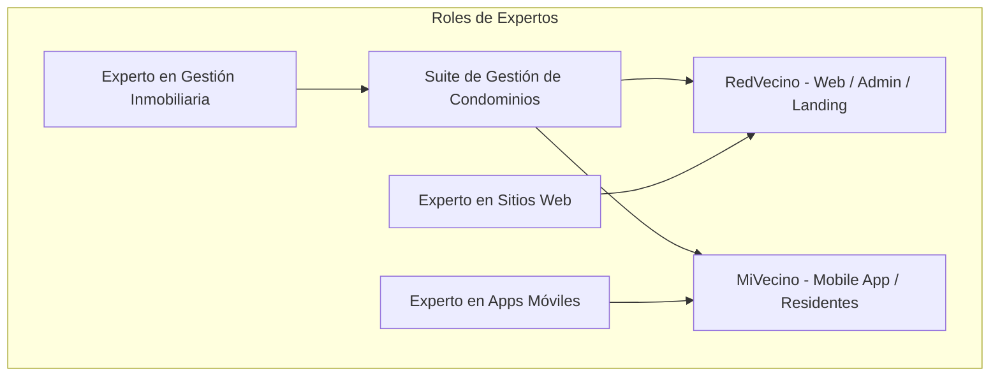

# 📜 Bitácora de Desarrollo e Historial del Proyecto (HISTORY) - RedVecino & MiVecino

> [!NOTE]
> Este documento registra la cronología detallada del proyecto **condominio-pro** (RedVecino & MiVecino), los hitos de ingeniería completados, la trazabilidad de auditorías y los resultados de calidad de software (QA). Garantiza el principio de conservación de memoria histórica e integración acumulativa.

---

## 📑 Índice de Navegación Rápida
1. [Consulta y Diagnóstico del Panel de Expertos](#-1-consulta-y-diagnóstico-del-panel-de-expertos)
2. [Lista de Tareas y Estado de Ejecución (TODO)](#-2-lista-de-tareas-y-estado-de-ejecución-todo)
3. [Registro de Cambios Cronológico (Walkthrough Fases 1 a 3)](#-3-registro-de-cambios-cronológico-walkthrough-fases-1-a-3)
4. [Refactorizaciones Backend, Motores Contables y TDD (Fases 4.1 a 4.7)](#-4-refactorizaciones-backend-motores-contables-y-tdd-fases-41-a-47)
5. [Refactorización Modular de Seeders y Sincronización Malla 1:1 (Fase 4.8)](#-5-refactorización-modular-de-seeders-y-sincronización-malla-11-fase-48)
6. [Hojas de Ruta Pendientes y Planificación Estratégica](#-6-hojas-de-ruta-pendientes-y-planificación-estratégica)

---

## 🧠 1. Consulta y Diagnóstico del Panel de Expertos

```mermaid
graph TD
    A[Suite de Gestión de Condominios] --> B[RedVecino - Web / Admin / Landing]
    A --> C[MiVecino - Mobile App / Residentes]
    
    subgraph Roles de Expertos
    D[Experto en Sitios Web] --> B
    E[Experto en Apps Móviles] --> C
    F[Experto en Gestión Inmobiliaria] --> A
    end
```

### 1.1 Especialista Senior en Sitios Web y Plataformas SaaS (Web Expert)
- **Landing Page de RedVecino:** Imagen corporativa robusta en **Azul Marino Profundo** (`#0F2557`) y **Teal/Turquesa** (`#00A896`).
- **Panel Administrativo (Dashboard Web):** Enfoque *Data-First*. Visualización de recaudación mensual, embudo de tickets y estado de ocupación.
- **UX Web:** Navegación lateral colapsable, tablas ordenables y modo oscuro nativo.

### 1.2 Especialista Senior en Experiencia Móvil (Mobile App Expert)
- **Alineación UI/UX Móvil (MiVecino):** Tono cercano con **Verde Césped** (`#72B043`) y **Naranja** (`#EC7A08`).
- **Layout Móvil:** Cuadrícula táctil de 6 iconos (**Comunicados, Reservas, Pagos, Incidencias, Documentos, Comunidad**) y barra de navegación inferior fija.

### 1.3 Especialista Senior en Administración de Condominios (Domain Expert)
- **Transparencia Financiera:** Desglose detallado de ítems contables y comprobantes.
- **Trazabilidad de Incidencias:** Asignación a colaboradores, notas de reparación y notificaciones en tiempo real.

---

## 🛠️ 2. Lista de Tareas y Estado de Ejecución (TODO)

### 2.1 Identidad Visual y Layouts (Completado)
- [x] Fusionar repositorio en `condominio-pro`.
- [x] Configurar tipografía corporativa `Montserrat` en Blade.
- [x] Implementar pantalla transicional de carga de roles (`RoleTransitionLoader`).
- [x] Integrar logotipos reales de marca `/images/Logo Redvecino.png` y `/images/Mi Vecino.png`.

### 2.2 Portal Residencial MiVecino (Completado)
- [x] Marco físico interactivo tipo smartphone responsive.
- [x] Barra inferior para pulgares (Inicio, Comunidad, +, Chat, Perfil).
- [x] Módulo de Pagos con simulación QR y reducción de deuda a $0.
- [x] Módulo de Incidencias con carga de fotos e historial de seguimiento.
- [x] Módulo de Reservas de amenidades con horario y estado.

---

## 📅 3. Registro de Cambios Cronológico (Walkthrough Fases 1 a 3)

### 3.1 Integración de Integración de Auditoría zAux
- Análisis de la reunión operativa 27/05/2026 y adaptación de casos de uso IA (IA Voice-Tickets, Actas de Asamblea con quórum doble ponderado).

### 3.2 Rediseño de la Estación del Administrador
- Migración a Sidebar lateral izquierda premium en `slate-950` con ancho maximizado.
- KPI cards vinculadas con eventos `onClick` para navegación fluida.
- Soporte para impersonación dinámica de usuario TI con reconmutación inmediata de vistas.

---

## 🏗️ 4. Refactorizaciones Backend, Motores Contables y TDD (Fases 4.1 a 4.7)

### 4.1 Refactor F0 → F6 (Agosto 2026)
- **Backend Adicional:** Entidades `unit_profiles`, `unit_members`, `supply_orders` y endpoints `/condominiums/{id}/finance`.
- **Mora Parametrizable:** Integración de `late_interest_rate` y `due_day` en `CommonExpenseCalculator`.
- **Estructura de Alícuotas:** Coeficientes por modelo (Depto `0.045`, Estacionamiento `0.010`, Bodega `0.010`).
- **Nómina y Liquidaciones:** Integración de liquidaciones de sueldo reales con AFP Habitat, Fonasa 7% y Seguro de Cesantía.
- **Transaccionales Demo:** Boletas de cobro 2026-07/08 y tickets operacionales vinculados.

---

## 🏢 5. Refactorización Modular de Seeders y Sincronización Malla 1:1 (Fase 4.8)

> [!IMPORTANT]
> **Plan Maestro de Seeders Domain-Driven (`database/seeders`):**
> Se refactorizó la base de datos completa creando un entorno de datos real y masivo entrelazado sin código espagueti.

### Resumen de Datos Generados
- **6 Condominios:** 1 Principal (*Altos del Valle*) + 5 Secundarios (*Parque del Inca, Providencia Plaza, Bosques de la Dehesa, Marina Poniente, Portal del Sur*).
- **240 Propiedades:** Departamentos, estacionamientos y bodegas asignadas.
- **214 Usuarios y Perfiles Spatie:** Administradores, Comités, Colaboradores, Propietarios y Residentes.
- **720 Pagos y Transacciones:** Historial de boletas y recaudaciones.
- **108 Tickets de Soporte Operativo:** Autocreación de categorías e incidencias vinculadas.
- **72 Reservas:** Quinchos, piscinas y canchas activas.

### Sincronización Malla Arquitectónica Visual
- Arreglo de importación de `useEffect` en `PropertyStructureBuilder.jsx`.
- Renderización dinámica en tiempo real de las 60+ unidades por condominio en la Malla Visual alineada 1:1 con el Registro de Unidades.
- Celdas interactivas en la tabla de **Últimos Pagos Registrados** con redirección directa a la vista de Finanzas.

---

## 🔮 6. Hojas de Ruta Pendientes y Planificación Estratégica

1. **Fusión Total de Tablas Financieras Legado:** Migrar completamente las consultas de `CommonExpense` a la arquitectura unificada `CommonExpensePeriod` y `CommonExpenseReceipt`.
2. **Consola Web de Emergencia TI:** Comandos interactivos adicionales en consola.
3. **Mantenimiento Preventivo con Fotos:** Obligatoriedad de fotografías en check-in / check-out de áreas comunes.

---
**Última actualización:** 10 de Agosto de 2026 (Bitácora Consolidada & Documentación Reestructurada v11.3)  
**Versión:** 11.3 (Modular Domain Seeders, 6 Condos, 240 Props, Malla Visual 1:1, 660+ Tests Passed)  
**Estado:** Bitácora Activa y Conservada.
