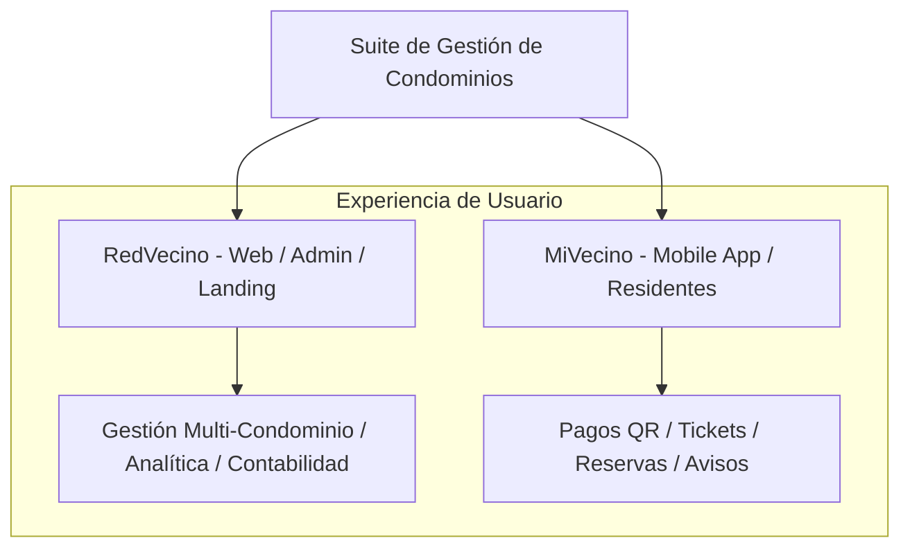

# 📘 Especificación Técnica del Proyecto (SPEC) - RedVecino & MiVecino

> [!NOTE]
> Este documento contiene la especificación técnica completa y viva del proyecto **RedVecino & MiVecino** (Condominio-PRO). Toda actualización o mejora debe entrelazarse preservando la trazabilidad histórica de requisitos y arquitecturas.

---

## 📑 Índice de Navegación Rápida
1. [Resumen Ejecutivo y Arquitectura Global](#-1-resumen-ejecutivo-y-arquitectura-global)
2. [Sistema de Identidad Visual (Design Board)](#-2-sistema-de-identidad-visual-design-board)
3. [Matriz RBAC de Roles y Aislamiento Multi-tenant](#-3-matriz-rbac-de-roles-y-aislamiento-multi-tenant)
4. [Análisis Estratégico (Six Thinking Hats)](#-4-análisis-estratégico-six-thinking-hats)
5. [Arquitectura Técnica y Stack del Sistema](#-5-arquitectura-técnica-y-stack-del-sistema)
6. [Módulos Funcionales del Sistema](#-6-módulos-funcionales-del-sistema)
7. [Fórmulas Matemáticas y Motores de Cálculo](#-7-fórmulas-matemáticas-y-motores-de-cálculo)
8. [Especificación Técnica de Módulos v2.0](#-8-especificación-técnica-de-módulos-v20)
9. [Constructor Visual de Infraestructura y Malla 1:1](#-9-constructor-visual-de-infraestructura-y-malla-11)
10. [Protocolo Obligatorio de Pruebas (Pest v3 & Vitest)](#-10-protocolo-obligatorio-de-pruebas-pest-v3--vitest)

---

## 🚀 1. Resumen Ejecutivo y Arquitectura Global

El ecosistema **RedVecino / MiVecino** es una suite SaaS integral para la administración, gestión financiera y convivencia comunitaria en condominios y edificios en régimen de copropiedad inmobiliaria (Ley de Copropiedad Inmobiliaria N° 21.442 en Chile).

### Interfaces del Ecosistema
1. **RedVecino (Web Corporativa & Panel de Administración):** Orientada a administradores, comités de copropiedad y personal de soporte TI. Su enfoque es la analítica financiera, la gestión masiva de datos y el control de flujos de trabajo administrativos.
2. **MiVecino (Web-App Móvil Responsive):** Orientada a copropietarios e inquilinos (residentes). Su enfoque es la simplicidad, la rapidez de acceso a información clave (gastos comunes, comunicados) y la facilidad de interacción (tickets de soporte, mensajería).

> **Slogan oficial:** *"Más que vecinos, somos comunidad."*

---

## 🎨 2. Sistema de Identidad Visual (Design Board)

### 2.1 Paleta de Colores y Tipografía
*   **Tipografía Oficial:** `Montserrat` (Cargada desde Google Fonts). Una tipografía geométrica, moderna y de alta legibilidad.
*   **Paleta de Colores Oficial:**
    *   🔵 **Azul Marino Profundo** (`#0F2557`): Color de estructura, base para el portal web de RedVecino.
    *   🟢 **Teal / Turquesa** (`#00A896`): Color moderno de enlace tecnológico.
    *   🍏 **Verde Césped** (`#72B043`): Identidad para MiVecino, representa cercanía y ecologismo.
    *   🍊 **Naranja Vibrante** (`#EC7A08`): Color de acento para notificaciones, llamados a la acción (CTA) e incidencias urgentes.
    *   🟣 **Morado / Violeta** (`#7A5299`): Categorización de módulos sociales y comunitarios.
    *   ⚪ **Gris Claro** (`#E2E8F0` / `#F8FAFC`): Para tarjetas, fondos limpios y bordes.

### 2.2 Arquitectura de Layouts UI (Estrategia de Dos Llaves)
*   🔑 **`RedVecinoLayout`** — Para roles de gestión administrativa (`TI`, `Administrador`, `Comité`, `Colaborador`). Pantalla completa con Sidebar izquierdo colapsable, Navbar superior con selector de condominio y acento cromático dinámico por rol.
*   🔑 **`MiVecinoLayout`** — Para roles residenciales (`Propietario`, `Residente`). Mobile-First con BottomNav fijo en móvil y Sidebar izquierdo en PC. Soporta detección dinámica de rol para adaptar pestañas y bloqueo de reservas por morosidad integradas.

---

## 👥 3. Matriz RBAC de Roles y Aislamiento Multi-tenant

El sistema implementa control de acceso basado en roles (RBAC) con **Spatie Laravel Permission**:

| Rol | Alcance | Descripción de Permisos |
|---|---|---|
| **TI (Soporte Técnico)** | Global | Gestión global de condominios, configuración del sistema, logs de auditoría y personalización de roles. |
| **Administrador** | Condominio Asignado | Control total del condominio asignado. CRUD de usuarios locales, emisión de gastos comunes, cobro de multas, asignación de tickets y comunicados. |
| **Comité (Comité de Copropiedad)** | Condominio Asignado | Supervisión financiera. Visualización de reportes, auditoría de flujo de caja (ingresos/egresos), aprobación de presupuestos y comunicados. |
| **Colaborador** | Operativo | Acceso simplificado enfocado a la resolución de problemas (conserjes, mantención). Gestión de tickets asignados y pedidos de insumos. |
| **Propietario** | Propiedad Asignada | Estado de cuenta de sus unidades, comprobantes de pago de gastos comunes, tickets de mantenimiento y vida comunitaria. |
| **Residente** | Unidad Habitacional | Ocupante (arrendatario/familiar). Mismas funciones del propietario en mantención y comunidad, sin operaciones de dominio financiero. |

> [!IMPORTANT]
> **Aislamiento Multi-Tenant:** Toda entidad transaccional (`properties`, `tickets`, `payments`, `condo_expenses`, `common_expense_periods`, `bookings`) requiere y valida la clave foránea `condominium_id` para garantizar un aislamiento relacional absoluto entre comunidades.

---

## 🧠 4. Análisis Estratégico (Six Thinking Hats)

*   **Sombrero Blanco (Racional):** RedVecino controla analítica y finanzas masivas en PC; MiVecino ofrece cuadrícula táctil de 6 botones y barra inferior en móviles. Stack: Laravel 12 + Inertia.js v2 + React 18 + Tailwind CSS.
*   **Sombrero Rojo (Emocional):** Entusiasmo por la cohesión de marca entre RedVecino y MiVecino. Sensación de producto premium.
*   **Sombrero Negro (Crítico):** Exigencia de mantener el aislamiento multi-condominio impecable y evitar sobrecarga visual mediante componentes modulares.
*   **Sombrero Amarillo (Optimista):** Diferenciación clara frente al software tradicional. El uso de Tailwind v4 y React Query agiliza el desarrollo UI.
*   **Sombrero Verde (Creativo):** Carga masiva mediante asistentes wizard, simulación OCR para correspondencia en conserjería y tarjetas interactivas 360°.
*   **Sombrero Azul (Director):** Mantener la alineación entre la documentación SPEC/HISTORY y el código ejecutable verificado por Pest v3.

---

## 🛠️ 5. Arquitectura Técnica y Stack del Sistema

| Capa | Tecnología Seleccionada | Detalle |
|---|---|---|
| **Backend** | Laravel 12.x / PHP 8.2+ | Arquitectura limpia con Services, Controllers y FormRequests. |
| **Frontend** | Inertia.js v2 / React 18 / Tailwind CSS v4 | SPA sin desacople de API REST separada. Componentes shadcn/ui. |
| **Base de datos** | SQLite (Dev/Test) / MySQL 8+ (Prod) | Transacciones ACID, claves foráneas e índices optimizados. |
| **Estado React** | TanStack React Query v5 | Cache contable y mutaciones con invalidación automática. |
| **Testing** | Pest PHP v3 + Vitest v4 | Suite automatizada de **660+ tests en verde (100% éxito)**. |

---

## 📐 6. Módulos Funcionales del Sistema

### 6.1 Módulo de Gestión de Usuarios y Propiedades
- **Multi-Tenant:** Filtrado automático por `condominium_id`.
- **Perfiles Específicos:** `owner_profiles`, `resident_profiles`, `employee_profiles`, `committee_profiles`, `admin_profiles`, `ti_profiles`.
- **Asignación de Unidades:** Asociación de propiedades (departamentos, casas, estacionamientos y bodegas) con alícuotas de copropiedad.

### 6.2 Módulo de Finanzas y Gastos Comunes
- **Catálogo Contable Estandarizado:** Categorías para ingresos (Gastos comunes, multas, quinchos, intereses de mora) y egresos (Sueldos, servicios básicos, mantenimiento, seguridad).
- **Emisión Masiva de Gastos Comunes:** Motor de cálculo por alícuota con Fondo de Reserva (5%) y saldos anteriores.
- **Conciliación y Registro:** Proceso de validación de comprobantes de pago por transferencia y cobro masivo.

### 6.3 Módulo de Tickets e Incidencias
- **Ciclo de Vida:** Flujo de estados (`open` → `in_progress` → `resolved` → `closed`).
- **Asignación:** Vinculación directa con colaboradores del condominio y notas de reparación.

### 6.4 Módulo de Comunicaciones y Vida Comunitaria
- **Comunicados:** Circulares con prioridad (`normal`, `importante`, `urgente`).
- **Amenidades y Reservas:** Control de cuotas, horarios y bloqueos preventivos por morosidad ($\ge 3$ meses impagos).

---

## 🧮 7. Fórmulas Matemáticas y Motores de Cálculo

### 7.1 Cálculo de Gastos Comunes por Unidad

$$\text{Monto Prorrateado } (M_{prorr}) = \text{Base Prorrateable} \times \alpha_i$$

$$\text{Subtotal Periodo } (S_{periodo}) = M_{prorr} + M_{igualitario}$$

$$\text{Fondo Reserva } (FR) = S_{periodo} \times \text{Tasa FR } (\text{default 5\%})$$

$$\text{Interés por Mora } (I_{mora}) = \text{Deuda Anterior} \times \text{Tasa Mora } (\text{default 1.5\%})$$

$$\text{Total a Pagar } (T_{pagar}) = S_{periodo} + FR + \text{Cargos Posteriores} + \text{Deuda Anterior} + I_{mora}$$

### 7.2 Resolución de Alícuota / Coeficiente ($\alpha_i$)
Prioridad de resolución centralizada en `UnitCoefficientResolver`:
1. Coeficiente explícito en la propiedad (`properties.coefficient`).
2. Porcentaje de propiedad registrado en el perfil (`owner_profiles.ownership_percentage`).
3. Proporción por metros cuadrados ($\text{area\_sqm} / \text{total\_area\_condo}$).
4. Fallback por defecto ($0.0100 \rightarrow 1\%$).

### 7.3 Liquidación de Remuneraciones (RRHH)

$$\text{Total Imponible } (H_{imp}) = \text{Sueldo Base} + \text{Asignación Responsabilidad} + \text{Horas Extras}$$

$$\text{Total No Imponible } (H_{no\_imp}) = \text{Colación} + \text{Movilización} + \text{Viáticos}$$

$$\text{Descuentos Previsionales } (D_{prev}) = \text{Salud (Fonasa 7\%)} + \text{AFP (10\% + Comisión)} + \text{Cesantía (0.6\%)}$$

$$S_{líquido} = (H_{imp} + H_{no\_imp}) - (D_{prev} + D_{otros})$$

---

## 🏢 8. Especificación Técnica de Módulos v2.0

*   `unit_profiles`: Fichas de Unidad (`parking_spot`, `license_plate`, `observation`).
*   `unit_members`: Integrantes por Unidad (`first_name`, `last_name`, `rut`, `is_owner`, `lives_in_unit`).
*   `supply_orders`: Pedidos de Insumos (`description`, `quantity`, `status`: `pendiente/en_compra/comprado/recibido`).
*   `checklist_records`: Inspección de Áreas Comunes (`entrega`, `recepcion`, fotos de evidencia).
*   `employee_warnings`: Amonestaciones de Personal (`verbal`, `escrita`, adjuntos).

---

## 🏬 9. Constructor Visual de Infraestructura y Malla 1:1

> [!TIP]
> **Sincronización Malla Arquitectónica Visual (`PropertyStructureBuilder.jsx` & `PropertiesList.jsx`):**
> La Malla Arquitectónica Visual recibe en tiempo real las propiedades reales filtradas del condominio activo. Visualiza en matriz de pisos $\times$ departamentos las 60+ unidades por condominio alineadas 1:1 con el Registro Contable de Unidades.

---

## 🧪 10. Protocolo Obligatorio de Pruebas (Pest v3 & Vitest)

El repositorio exige el cumplimiento estricto de pruebas automatizadas:
- **Backend (Pest v3):** 486+ tests en verde probando validaciones numéricas de rango, aislamiento multi-tenant y permisos Spatie.
- **Frontend (Vitest):** 174+ tests en verde sobre componentes React, hooks financieros y layouts.
- **Total Suite:** **660+ tests pasados con 0 errores (100% Éxito)**.

---
**Fecha de creación:** Mayo 2026  
**Última actualización:** 10 de Agosto de 2026 (Auditoría de Reestructuración & Documentación Unificada v11.3)  
**Versión:** 11.3 (Unified Architecture, Visual Grid 1:1, Full Test Suite 100% Green)  
**Estado:** Documento Oficial Activo.